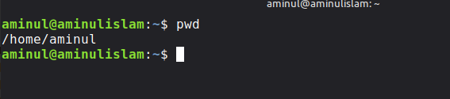
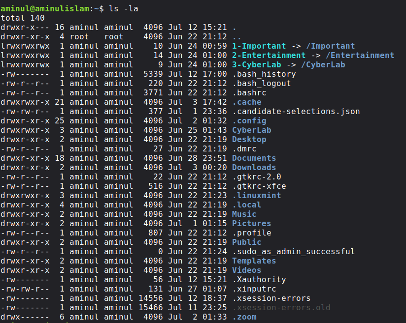
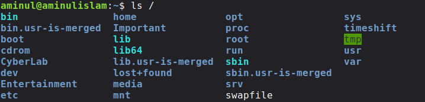
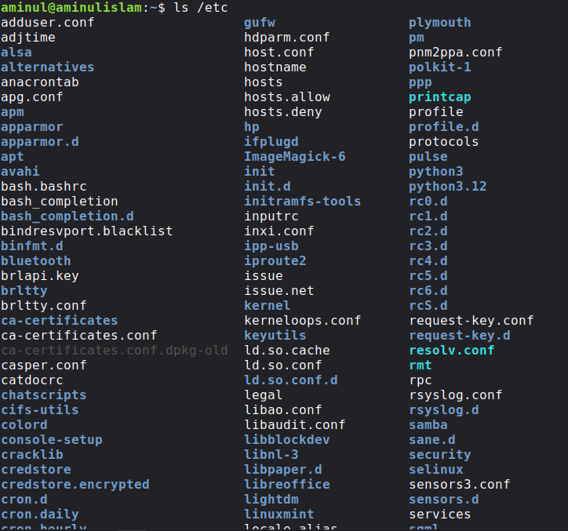
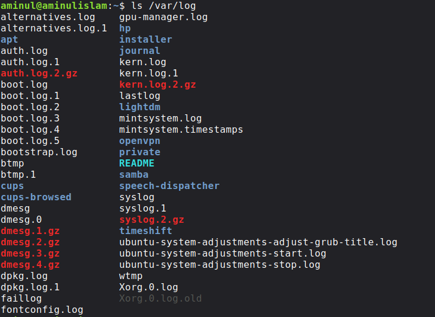
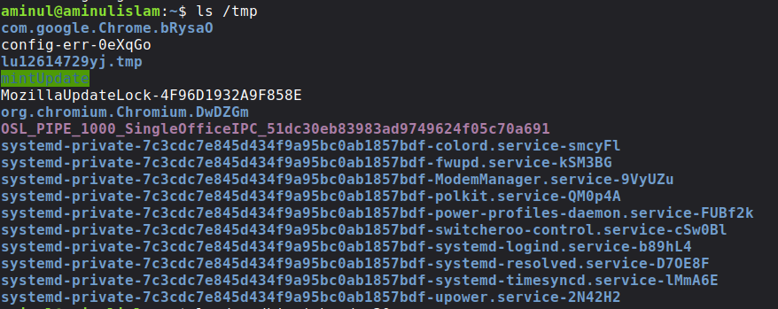
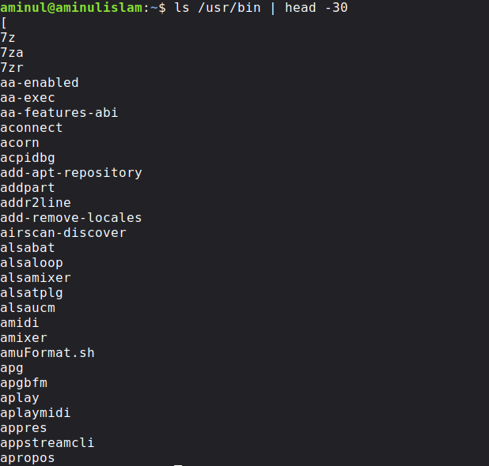

# Journal 01 – Linux Filesystem Basics

**Month:** 02 – Linux CLI Mastery  
**Week:** 05 – Filesystem & Navigation  
**Journal:** 01  
**Operating System:** Linux Mint 22.3 (Zena)  
**Kernel:** Ubuntu Noble Base  
**Author:** Aminul Islam


# Objective

To become familiar with the Linux filesystem hierarchy, understand the purpose of important system directories, and practice basic navigation commands.


# Background

Unlike Microsoft Windows, Linux organizes everything under a single directory tree that begins with the root directory (`/`).

Understanding this hierarchy is one of the first essential skills for Linux administration, cybersecurity, and technical documentation because configuration files, user data, executable programs, and system logs all reside in predictable locations.

This journal documents my first exploration of the Linux filesystem using Linux Mint 22.3 (Zena).


# Lab Environment

| Item | Value |
|-------|-------|
| Distribution | Linux Mint 22.3 (Zena) |
| Base | Ubuntu 24.04 LTS (Noble) |
| Desktop | Cinnamon |
| Terminal | Bash |
| User | aminul |


# Commands Used

| Command              | Purpose |
|----------------------|---------|
| `pwd`                | Display current working directory |
| `ls`                 | List directory contents |
| `ls -l`              | Long listing format |
| `ls -la`             | Show all files including hidden files |
| `ls /`               | View root filesystem |
| `ls /etc`            | List configuration directory |
| `ls /var/log`        | View log directory |
| `ls /tmp`            | View temporary directory |
| `ls /usr/bin | head -30` | Display the first 30 executable programs |


# Command Examples & Output

## 1. Current Working Directory

```bash
pwd
Output

/home/aminul

The terminal starts inside my personal home directory.

2. List Files

ls

This displayed the files and folders inside my home directory.

3. Long Listing

ls -l

I observed information such as:

permissions
owner
group
file size
modification date
filename

4. Show Hidden Files

ls -la

This command displayed hidden files beginning with a dot (.), such as:

.bashrc
.profile
.cache
.config
.local

These hidden files store user-specific configuration settings.

5. Root Directory

ls /

Important directories included:

bin
boot
dev
etc
home
lib
media
mnt
opt
proc
root
run
sbin
srv
sys
tmp
usr
var

6. Configuration Directory

ls /etc

This directory contained hundreds of system configuration files and subdirectories.

Examples included:

apt
bash.bashrc
fstab
group
hostname
hosts
network
passwd
shadow
ssh
systemd

7. System Logs

ls /var/log

I observed many log files such as:

apt
auth.log
boot.log
dpkg.log
kern.log
syslog

8. Temporary Directory

ls /tmp

This directory stores temporary files created by applications and the operating system.

9. Executable Programs

ls /usr/bin | head -30

The output showed the first thirty executable programs installed on the system.

This demonstrates that Linux commands such as ls, cp, mv, grep, and many others are stored as executable files.


# Observations & Findings

Linux uses one unified directory tree beginning with /.
Every file and directory has a specific purpose.
Hidden configuration files begin with a period (.).
The /etc directory stores configuration files rather than executable programs.
System logs are stored under /var/log.
User applications and commands are mainly stored under /usr/bin.
My personal files are stored inside /home/aminul.


# Key Concepts Learned

## Root Directory (/)

The top-most directory of the Linux filesystem.

Everything begins here.

## Home Directory (/home)

Stores personal files and settings for each user.

## Configuration Directory (/etc)

Contains system-wide configuration files.

## Log Directory (/var/log)

Stores operating system and application log files.

## Temporary Directory (/tmp)

Stores temporary data created by users and applications.

## Executable Programs (/usr/bin)

Contains most user commands and executable programs.


# Security Perspective

Understanding the Linux filesystem is fundamental for cybersecurity because investigators, administrators, and attackers all rely on knowing where important information is stored.

Examples include:

Directory	Security Importance
/etc	Configuration files, user accounts, SSH settings
/var/log	Authentication logs, system events, forensic evidence
/home	User documents, SSH keys, browser data
/tmp	Temporary files often abused by malware
/usr/bin	Installed executables and utilities
/root	Root user's private home directory
/proc	Live information about running processes

Knowing these locations is essential during:

Incident response
Malware analysis
System auditing
Digital forensics
Security hardening


# Screenshots

### 1. Current Working Directory (`pwd`)




### 2. Home Directory Listing (`ls -la`)




### 3. Root Directory (`ls /`)




### 4. Configuration Directory (`ls /etc`)




### 5. System Logs (`ls /var/log`)




### 6. Temporary Directory (`ls /tmp`)




### 7. Executable Programs (`ls /usr/bin | head -30`)



# Reflection

This journal helped me understand that Linux organizes the operating system into a logical directory hierarchy rather than using multiple drive letters.

I also learned that many important cybersecurity artifacts—including configuration files, authentication logs, user data, and executable programs—are stored in well-defined locations.

Instead of memorizing commands, I am beginning to understand how the Linux operating system is structured internally.

# Skills Developed

Basic terminal navigation
Exploring the Linux filesystem
Reading command output
Understanding hidden files
Identifying important system directories
Recognizing security-relevant locations

## Next Step

Journal 02 will focus on filesystem navigation using commands such as:

cd
pwd
Relative paths
Absolute paths
. (current directory)
.. (parent directory)
~ (home directory)

## References
Linux Mint Documentation
GNU Core Utilities Documentation
Filesystem Hierarchy Standard (FHS)
man ls
man pwd
