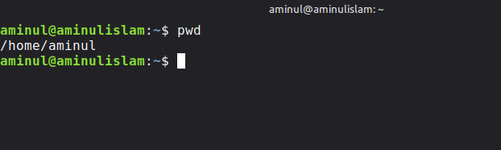
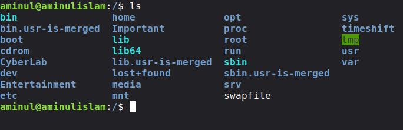
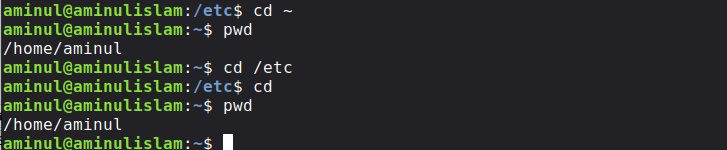
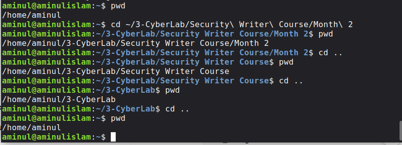
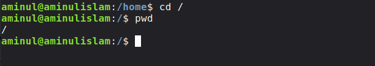
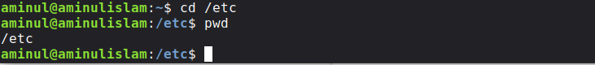
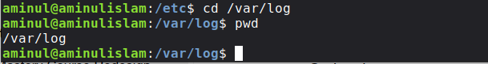
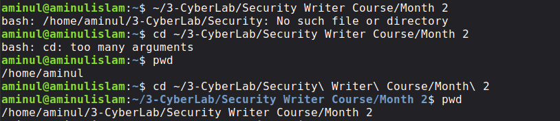
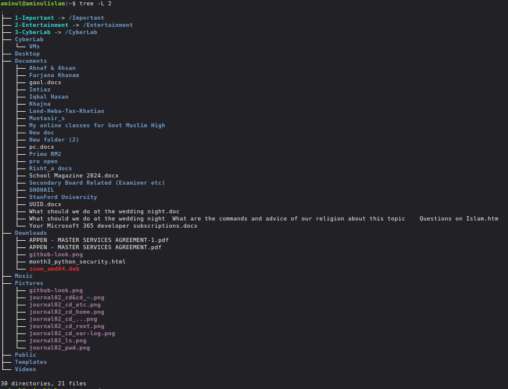

# Journal 02 — Linux Navigation and Directory Traversal

Month 02 – Linux CLI Mastery
Week 05 – Day 02

## Objective

The objective of this lab was to understand how navigation works in Linux using the command line. During this exercise, I practiced moving between directories, learned the difference between absolute and relative paths, explored special directory symbols, and examined the Linux directory hierarchy.

## Background

Unlike graphical operating systems where folders are opened by clicking icons, Linux administrators and cybersecurity professionals spend much of their time navigating the filesystem through the terminal.

Efficient navigation is one of the most fundamental Linux skills because nearly every administrative, automation, scripting, and security task depends on locating files and moving quickly through the filesystem.

Understanding directory navigation is also essential for:

* system administration
* incident response
* digital forensics
* penetration testing
* log analysis
* Bash scripting
* automation

| Item              | Details                  |
| ----------------- | ------------------------ |
| Operating System  | Linux Mint 22.3 (Zena)   |
| Base Distribution | Ubuntu 24.04 LTS (Noble) |
| Shell             | Bash                     |
| User              | aminul                   |
| Terminal          | GNOME Terminal           |

## Command Examples & Output
### Finding the current directory
pwd

### Purpose

Displays the current working directory.

### Output

/home/aminul

### Returning to the home directory
cd

or

cd ~

Purpose

Returns to the current user's home directory.

Observed

Both commands produced the same result.

### Staying in the current directory
cd .

Purpose

. represents the current directory.

No visible change occurs because the shell remains in the same location.

### Moving to the parent directory
cd ..

Purpose

Moves one level upward.

Example

/home/aminul

↓

/home

↓

/

### Going to the root directory
cd /

Purpose

Moves directly to the root of the Linux filesystem.

### Navigating to common system directories

cd /home

cd /etc

cd /var/log

cd /usr/bin

Purpose

Practice moving to important Linux directories.

### Returning home from anywhere
cd

Purpose

Returns to

/home/aminul

regardless of the current location.

### Viewing directory contents

ls

ls -l

Purpose

Display files and directories.

Observed

My home directory contains symbolic links such as:

1-Important
2-Entertainment
3-CyberLab

and normal directories such as

Documents
Downloads
Pictures
Videos

The ls -l output also demonstrated the difference between symbolic links (l) and directories (d).

### Displaying directory hierarchy

tree -L 2

Purpose

Shows the directory structure up to two levels deep.

This command provided a clear visualization of the organization of the home directory.

## Understanding Paths
### Absolute Path

An absolute path always starts from the root directory (/) and points to the same location regardless of the current working directory.

Example

/home/aminul/Documents

An absolute path is similar to writing a complete postal address.

### Relative Path

A relative path starts from the current working directory.

Example

Suppose the current directory is

/home/aminul/Documents

Instead of typing

cd /home/aminul/Documents/Linux

I can simply write:

cd Linux

because the shell already knows the starting location.

## Important Symbols Learned

| Symbol | Meaning                       |
| ------ | ----------------------------- |
| `/`    | Root directory                |
| `~`    | Current user's home directory |
| `.`    | Current directory             |
| `..`   | Parent directory              |

These symbols are used constantly in Linux administration and Bash scripting.

## Mistakes I Made (Learning Moments)

One of the best parts of this practice session was intentionally encountering errors and understanding why they occurred.

### Mistake 1

cd~

Result

Command 'cd~' not found

Reason

A space is required between the command and its argument.

Correct command

cd ~

### Mistake 2

cd..

Result

command not found

Reason

Again, a missing space.

Correct command

cd ..

### Mistake 3

cd /aminul

Result

No such file or directory

Reason

The directory does not exist.

The correct path is

/home/aminul

### Mistake 4

While inside

/etc

I typed

cd var/log

Result

No such file or directory

Reason

Because the path was interpreted as

/etc/var/log

instead of

/var/log

Correct command

cd /var/log

### Mistake 5

Attempting to enter a directory containing spaces without escaping them:

cd ~/3-CyberLab/Security Writer Course/Month 2

Result

too many arguments

Correct command

cd ~/3-CyberLab/Security\ Writer\ Course/Month\ 2

This exercise reinforced how Linux treats spaces as argument separators.

## Command Output Summary

During this lab I successfully navigated among:

/

↓

/home

↓

/home/aminul

↓

/etc

↓

/var/log

↓

/usr/bin

↓

Documents

↓

Project folders

I also confirmed the difference between symbolic links and normal directories using

ls -l

and visualized my home directory structure with

tree -L 2

## Observations & Findings

Throughout this exercise I observed that:

Linux navigation is entirely path-based.
Commands are case-sensitive.
Spaces inside directory names require escaping (\) or quotation marks.
Absolute paths work regardless of the current location.
Relative paths depend on the current working directory.
The terminal provides informative error messages that help diagnose mistakes.
Key Concepts Learned

During this lab I learned:

* Current working directory
* Home directory
* Root directory
* Absolute paths
* Relative paths
* Parent directory
* Current directory
* Symbolic links
* Directory hierarchy
* Escaping spaces in filenames
* Security Perspective

From a cybersecurity perspective, efficient navigation is a foundational operational skill. Security professionals frequently move through the filesystem to inspect configuration files, collect logs, verify permissions, locate executables, and investigate suspicious activity.

The navigation techniques practiced in this lab support many security tasks, including:

* locating system configuration files in /etc
* examining authentication and application logs in /var/log
* identifying installed binaries in /usr/bin
* accessing user home directories during investigations
* moving efficiently during incident response and forensic analysis

Although today's commands did not modify the system, they form the basis for many future administrative and security operations.

## Skills Developed
  
* Linux terminal navigation
* Directory traversal
* Absolute and relative paths
* Reading filesystem hierarchy
* Error interpretation
* Basic troubleshooting
* Terminal confidence

## Screenshots

### 1. Display Current Working Directory (`pwd`)

---

### 2. List Files and Directories (`ls`)

---
### 3. Change to Home Directory (`cd /home`)

---

### 4. Return to Home Directory (`cd ~` or `cd`)

---

### 5. Navigate to Parent Directory (`cd ..`)

---

### 6. Navigate to Root Directory (`cd /`)

---

### 7. Navigate to `/etc` Directory (`cd /etc`)

---

### 8. Navigate to `/var/log` Directory (`cd /var/log`)

---

### 9. Common Command Errors

---

### 10. Directory Tree (`tree -L 2`)

An example showing one or two command errors (such as cd~ or cd..) to demonstrate troubleshooting.

## Reflection

Today's practice strengthened my understanding of Linux directory navigation. I intentionally explored different locations in the filesystem and learned from several command errors. Instead of treating these mistakes as failures, I used them to better understand how Bash interprets commands, paths, and spaces.

I also became more comfortable moving between important system directories and gained confidence in using both absolute and relative paths. These navigation skills will support future work in Linux administration, Bash scripting, and cybersecurity.

## Next Step

In the next journal, I will focus on:

### Journal 03 — File and Directory Operations

Topics include:

* mkdir
* touch
* cp
* mv
* rm
* rmdir
* cat
* less
* head
* tail

These commands will introduce safe file management practices and form the foundation for later scripting and automation tasks.

## References

* Linux Mint Documentation
* GNU Bash Manual
* Filesystem Hierarchy Standard (FHS)
* man cd
* man pwd
* man ls
* man tree
