# Linux File Operations

## Objective

To learn the fundamental Linux file and directory operations used every day by Linux users, system administrators, cybersecurity analysts, and technical writers. This lab focused on creating directories and files, writing file contents, copying, moving, deleting, and viewing files from the Linux terminal.

## Background

The Linux command line provides powerful tools for managing files without relying on a graphical interface. Since Linux treats almost everything as a file, mastering file operations is an essential skill for system administration, cybersecurity investigations, scripting, and documentation.

In this lab, I created a dedicated practice environment named Linux-labs and performed common file-management tasks while observing how Linux responds to both correct and incorrect commands.

## Environment

| Item              | Value                                                       |
| ----------------- | ----------------------------------------------------------- |
| Operating System  | Linux Mint 22.3 (Zena)                                      |
| Distribution Base | Ubuntu 24.04 LTS (Noble)                                    |
| Shell             | Bash                                                        |
| User              | aminul                                                      |
| Working Directory | `/home/aminul/3-CyberLab/Security Writer Course/Linux-labs` |

## Commands Used

mkdir
pwd
ls
ls -l
touch
cat
echo
cp
mv
rm
rmdir
head
tail
less
nano
cd

## Command Examples & Output
1. Creating the working directory

  mkdir Linux-labs
  cd Linux-labs
  pwd

Output

  /home/aminul/3-CyberLab/Security Writer Course/Linux-labs

## 2. Creating multiple directories

  mkdir documents scripts logs evidence memory pcaps reports

Checking the result

  ls

Output

  documents
  evidence
  logs
  memory
  pcaps
  Practice
  reports
  scripts

## 3. Creating files

  touch notes.txt
  touch report.txt
  touch evidence.txt
  touch todo.txt

Listing files

  ls

Output

  evidence.txt
  notes.txt
  report.txt
  todo.txt

## 4. Writing text into a file

  echo "I have entered the 3-CyberLab..." > notes.txt

Reading the file

  cat notes.txt

Output

  I have entered the 3-CyberLab and then Security Writer Course...

## 5. Appending text

  echo "Now, I'd like to add some more text..." >> notes.txt

Output

  cat notes.txt

The new text appeared below the original content.

## 6. Copying a file

  cp notes.txt backup.txt

Checking

  ls

Output

  backup.txt
  evidence.txt
  notes.txt
  report.txt
  todo.txt

## 7. Renaming a file

  mv backup.txt notes_backup.txt

Output

  notes_backup.txt

Now, when I verified with 'ls', backup.txt file is no more there. Instead, it's renamed to notes_backup.txt, and notes_backup.txt file is there. When 'mv' command is used in the same directory, the file name is changed only, and the file name just gets a new name! 

## 8. Moving a file
  
  mv report.txt ../logs/

Verification

  ls logs

Output

  report.txt

## 9. Removing a file

  rm todo.txt

Checking

  ls

Output

  evidence.txt
  notes_backup.txt
  notes.txt

## 10. Creating and removing an empty directory

  mkdir empty

Removing it

  rmdir empty

No output indicates success.

## 11. Reading portions of a file

Beginning of file

  head notes.txt

Output

  Linux File Operations Lab

  Learning Bash Commands

  I have entered the 3-CyberLab...

End of file

  tail notes.txt

Output

  Good luck.
  
  Now, check the head.
  
  Lastly, check the tail.

## 12. Viewing a file interactively

  less notes.txt

The file opened in the pager. I exited by pressing *q*.

## 13. Editing a file

  nano notes.txt

I edited the file, saved the changes (Ctrl + O, Enter) and exited using Ctrl + X.

## Observations & Findings

* Linux commands generally produce no output when successful.
* The *mkdir* command can create multiple directories in a single command.
- *touch* creates an empty file instantly.
- *echo >* overwrites a file.
- *echo >>* appends text to an existing file.
- *cp* duplicates files while preserving the original.
- *mv* is used both for moving and renaming files.
- *rm* permanently deletes files without sending them to a recycle bin.
- *rmdir* only removes empty directories.
- *head* and *tail* are useful for quickly inspecting large files.
- *less* allows interactive viewing without loading the whole file into memory.
- *nano* provides a simple terminal-based text editor.

## Key Concepts Learned

- File creation
- Directory creation
- File viewing
- File editing
- File copying
- File renaming
- File movement
- File deletion
- Empty directory removal
- Output redirection
- Appending text
- Working with relative paths

## Security Perspective

From a cybersecurity perspective, secure file handling is one of the most fundamental skills. During incident response or forensic investigations, analysts frequently create working directories to organize collected evidence, logs, memory dumps, packet captures, and investigation reports.

This lab demonstrated several practices that directly relate to cybersecurity work:

- Creating a structured workspace for investigation artifacts.
- Preserving originals by copying files before making changes.
- Using descriptive filenames to improve evidence management.
- Understanding that *rm* permanently removes files, making careful verification essential.
- Inspecting only the beginning or end of large log files with *head* and *tail*, which is often faster than opening the entire file.
- Editing text-based configuration or documentation files using terminal editors such as *nano*.

Good file management is a foundational skill for system administrators, security analysts, digital forensic investigators, and technical documentation engineers.

## Mistakes I Made (Learning Moments)

### 1. Forgetting to escape spaces

I typed:

  ~/3-CyberLab/Security Writer Course/Linux-labs

Result

  No such file or directory

Lesson:

Directory names containing spaces must either be escaped:

  Security\ Writer\ Course

or enclosed in quotation marks.

### 2. Trying to execute a directory

I entered:

  ~/3-CyberLab/Security\ Writer\ Course/Linux-labs

Output

  Is a directory

Lesson:

Directories cannot be executed. To enter a directory, use the *cd* command.

### 3. Typing cd..

  cd..

Output

  cd..: command not found

Lesson:

A space is required.

Correct command:

  cd ..

### 4. Attempting to remove a non-empty directory

  rmdir documents

Output

  rmdir: failed to remove 'documents': Directory not empty

Lesson:

rmdir only removes empty directories.

### 5. Trying to recreate an existing directory

  mkdir documents

Output

  mkdir: cannot create directory ‘documents’: File exists

Lesson:

Always verify existing files and directories with *ls* before creating new ones.

## Screenshots

### 1. Create an Empty File (`touch`)

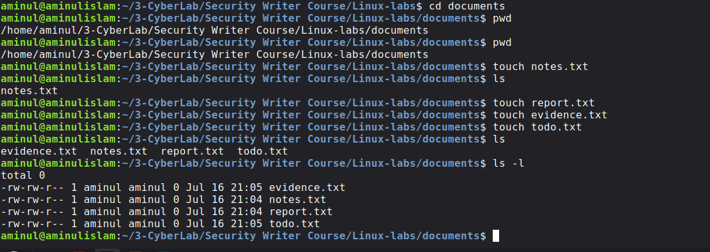

---

### 2. Display File Contents and Append Text (`cat` and `echo`)

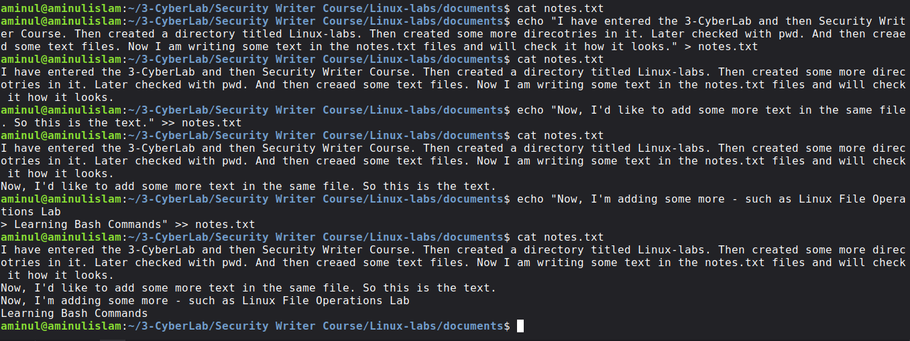

---

### 3. View the Beginning and End of a File (`head` and `tail`)

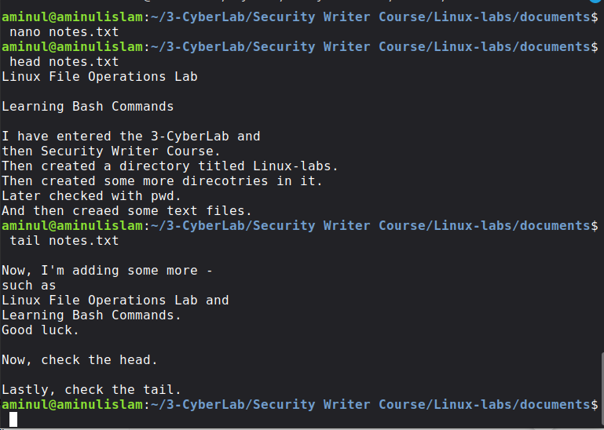

---

### 4. View File Contents One Screen at a Time (`less`)

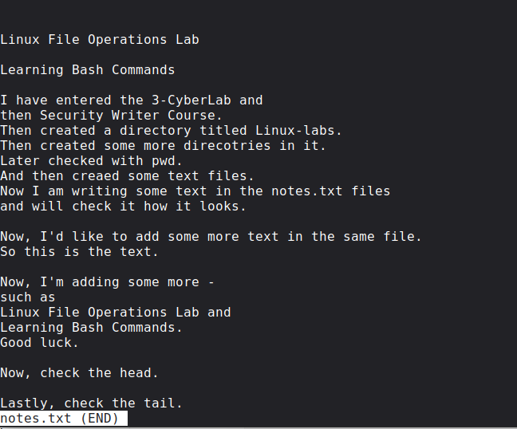

---

### 5. Create a New Directory (`mkdir`)

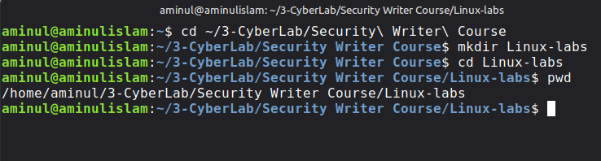

---

### 6. Verify Directory Creation (`mkdir` and `ls`)

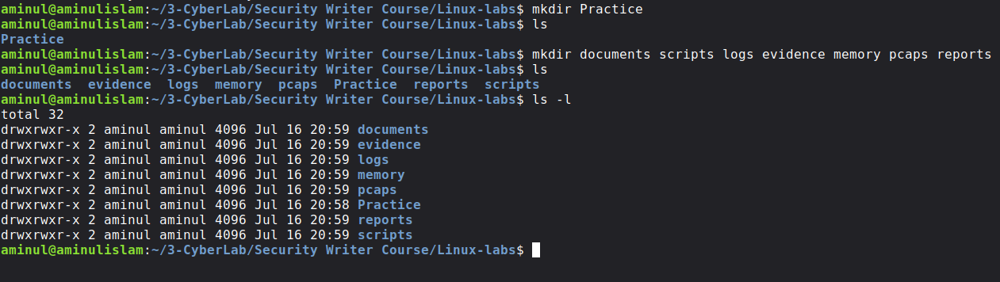

---

### 7. Copy Files (`cp`)

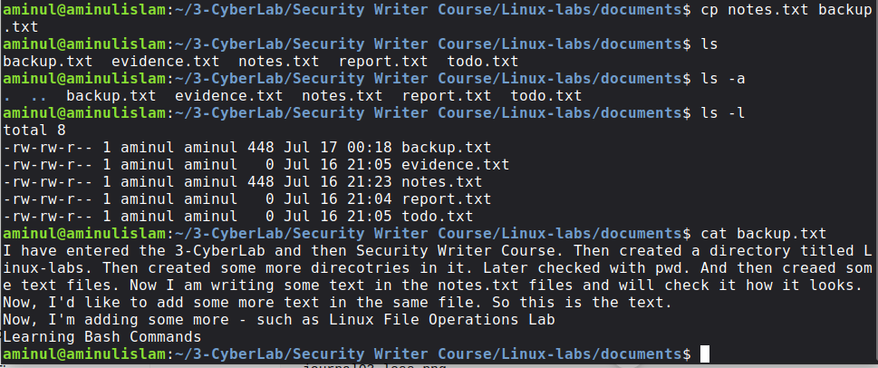

---

### 8. Move or Rename Files Within the Same Directory (`mv`)

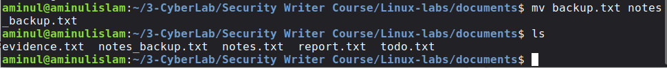

---

### 9. Move Files to a Different Directory (`mv`)

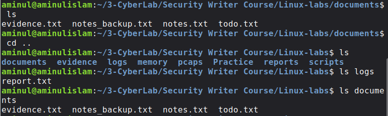

---

### 10. Remove Files (`rm`)

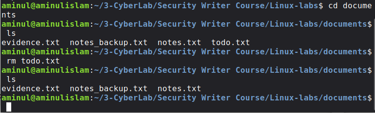

---

### 11. Remove an Empty Directory (`rmdir`)

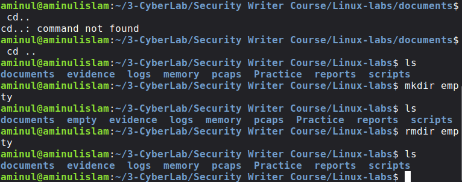

---

### 12. Common Error: Creating an Existing Directory (`mkdir`)

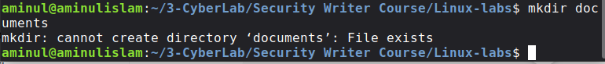

---

### 13. Common Error: Removing a Non-Empty Directory (`rmdir`)

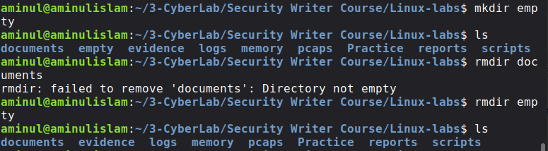

---

### 14. Common Error: Changing to a Non-Existent Directory (`cd`)

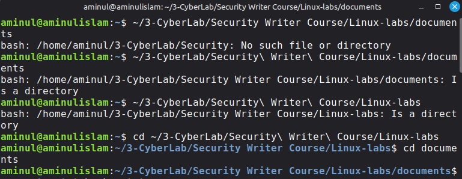

## Skills Developed

- Linux file management
- Directory organization
- Bash command-line navigation
- File editing
- Output redirection
- File copying and movement
- Safe file deletion
- Reading large text files efficiently
- Terminal troubleshooting
- Technical documentation practices

## Related Commands
  find
  locate
  file
  stat
  wc
  sort
  uniq
  grep
  diff
  cmp

These commands build naturally on today's work and will be useful in later lessons.

## Reflection

This lab strengthened my understanding of how Linux handles files and directories through the command line. I learned that successful commands often produce no output, making verification with commands such as *ls*, *pwd*, or *cat* an important habit.

I also discovered that many of my mistakes came from small typing errors—such as forgetting to escape spaces in directory names or omitting the space in *cd ..*. Rather than seeing these as failures, I now view them as valuable learning experiences because they helped me understand how Bash interprets commands.

Most importantly, I began organizing my practice environment in a way that resembles a real cybersecurity workspace, with separate directories for documents, logs, evidence, memory, packet captures, reports, and scripts. This habit will support my long-term goal of becoming a Cybersecurity Documentation & Automation Engineer.

## Next Step

In the next journal, I will explore Linux file permissions and ownership, including:

- permission notation
- symbolic and numeric permissions
- chmod
- chown
- groups
- security implications of file permissions

## References

- Linux Mint 22.3 Documentation
- GNU Core Utilities Manual
- Bash Manual (man bash)
- man mkdir
- man touch
- man cp
- man mv
- man rm
- man head
- man tail
- man less
- man nano

