# Linux File Permissions, Ownership & Access Control

## Objective

The objective of this lab was to understand how Linux controls access to files and directories through permissions, ownership, and groups. I learned how to inspect permissions, modify them using symbolic and numeric modes, change file ownership and group ownership, identify my user identity and group memberships, and understand why some system files require elevated privileges.

## Background

Linux is a multi-user operating system where many users and services share the same machine. Without a permission system, any user could accidentally—or intentionally—modify critical system files.

Linux protects the operating system through three main concepts:

Ownership
Groups
Permissions

Understanding these concepts is essential for Linux administration, cybersecurity, system hardening, digital forensics, and incident response.

## Environment

| Item              | Value                    |
| ----------------- | ------------------------ |
| Operating System  | Linux Mint 22.3 (Zena)   |
| Base Distribution | Ubuntu 24.04 LTS (Noble) |
| Terminal          | Bash                     |
| User              | aminul                   |
| Practice Folder   | `~/permission-lab`       |

## Commands Used

### Creating the Lab

```Bash
mkdir permission-lab
cd permission-lab
touch notes.txt
touch script.sh
mkdir reports
```

### Viewing Permissions

```ls -l
ls -ld reports
stat notes.txt
```

### Symbolic Permissions

```Bash
chmod u-w notes.txt
chmod u+w notes.txt

chmod u-w reports
chmod u+w reports

chmod u-x reports
chmod u+x reports
```

### Numeric Permissions

```chmod 644 notes.txt
chmod 600 notes.txt
chmod 755 script.sh
chmod 000 notes.txt
chmod 644 notes.txt
```

### Ownership
```Bash
sudo chown root:root notes.txt

sudo chown aminul:aminul notes.txt

sudo chgrp root reports

sudo chgrp aminul reports
```

### Identity

```whoami
id
groups
```

### Protected Files

```cat /etc/shadow

sudo cat /etc/shadow
```

## Command Examples & Output

During the lab I observed:

`-rw-r--r--`

after

`chmod 600 notes.txt`

became

`-rw-------`

which means

Owner

`read + write`

Group

`no permission`

Others

`no permission`

Changing the script

`chmod 755 script.sh`

produced

`-rwxr-xr-x`

meaning

Owner

```read
write
execute
```
Group

```read
execute
```
Others

```read
execute
```
Attempting

`cat /etc/shadow`

returned

`Permission denied`

Running

`sudo cat /etc/shadow

displayed the protected password database, demonstrating that only privileged users may access sensitive authentication information.

## Observations & Findings

During this lab I noticed several important behaviors:

- Every newly created file receives default permissions based on the system umask.
- Directories display permissions differently because the execute (x) bit controls entering the directory.
- Symbolic permissions are easy for making small permission changes.
- Numeric permissions provide precise control over file access.
- Ownership determines who can modify a file.
- Group ownership allows controlled collaboration among multiple users.
- Sensitive system files are protected by default.
- Running commands with sudo temporarily grants administrative privileges but should be used only when necessary.

## Key Concepts Learned

I learned the difference between:

### File Owner

The user who owns the file.

### Group

A collection of users who may share access.

### Others

Everyone else on the system.

Permission bits:

```r = read
w = write
x = execute
```
Numeric values:

```4 = read
2 = write
1 = execute
```
Examples:

```644
600
755
777
000
```

## Security Perspective

This lab demonstrated how Linux protects the operating system through least-privilege access control.

From a cybersecurity perspective, permissions help:

- prevent unauthorized access to sensitive files
- protect system configuration files
- safeguard password databases such as `/etc/shadow`
- reduce accidental modification of critical files
- limit malware from altering protected resources
- enforce the Principle of Least Privilege (PoLP), where users and processes receive only the permissions they require

Understanding file permissions is a core skill for system administrators, security analysts, incident responders, and digital forensic investigators.

## Mistakes I Made (Learning Moments)

This lab included several valuable mistakes that strengthened my understanding:

### Mistake 1

Typed

`ch permission-lab`

instead of

`cd permission-lab`

Result:

`command not found`

Lesson:

Always verify the command before pressing Enter.

### Mistake 2

Typed

`mddir`

instead of

`mkdir`

Lesson:

Small typing errors are common; carefully reading the shell's error message helps identify the correct command.

### Mistake 3

Tried

`rm reports`

Result:

`Is a directory`

Lesson:

Directories require `rmdir` (if empty) or `rm -r` (for recursive removal).

### Mistake 4

Attempted

`chmod 777 important.txt`

Result:

`No such file or directory`

Lesson:

Always confirm the file exists before changing permissions.

### Mistake 5

Ran

`chown notes.txt`

without specifying a new owner.

Result:

`missing operand`

Lesson:

chown requires both the owner (or owner:group) and the target file.

## Screenshots

### 1. Create a File for Permission Practice

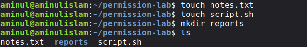

---

### 2. View Default File Permissions (`ls -l`)

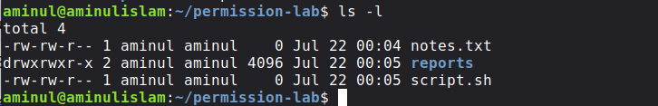

---

### 3. Attempt to Read `/etc/shadow` (Permission Denied)

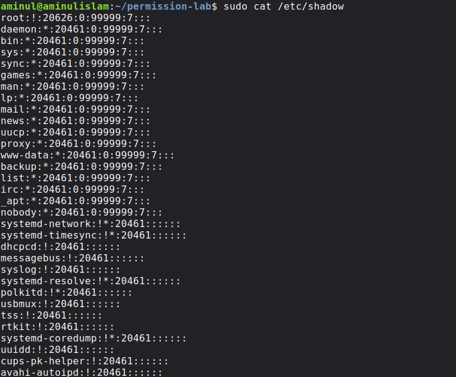

---

### 4. Change File Permissions to `644` and `600` (`chmod`)

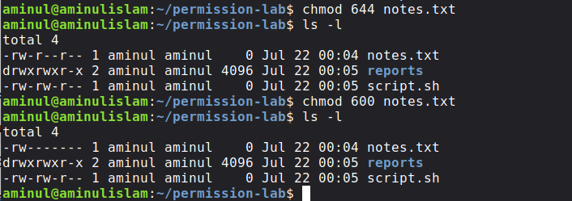

---

### 5. Change File Permissions to `755` (`chmod`)

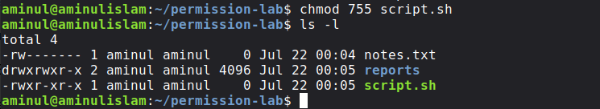

---

### 6. Remove Write Permission (`chmod u-w`)

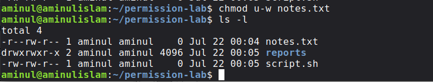

---

### 7. Restore Write Permission (`chmod u+w`)

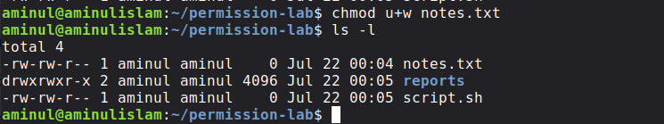

---

### 8. Remove Execute Permission (`chmod u-x`)

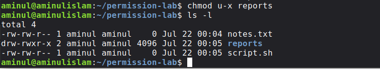

---

### 9. Restore Execute Permission (`chmod u+x`)

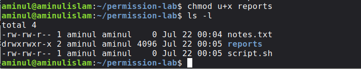

---

### 10. Permission Denied Example

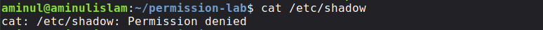

---

### 11. Common `chmod` Errors and Corrections

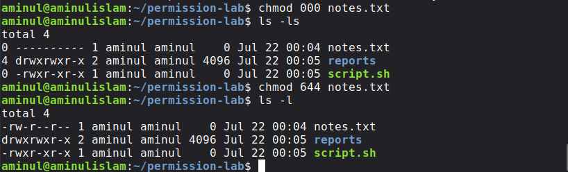

---

### 12. Change Group Ownership (`chgrp`)

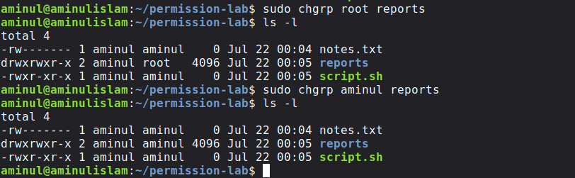

---

### 13. Change File Owner to `aminul` (`chown`)

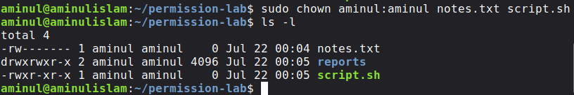

---

### 14. Change File Owner to `root` (`chown`)

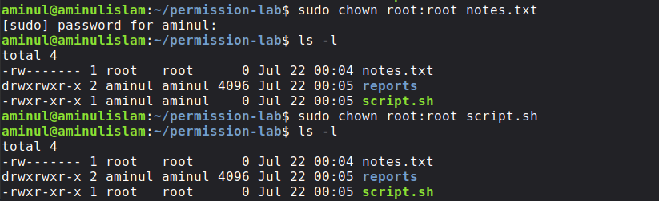

---

### 15. Common `chown` Errors

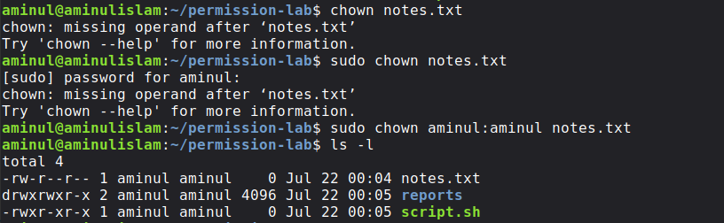

---

### 16. Display File Information (`stat notes.txt`)

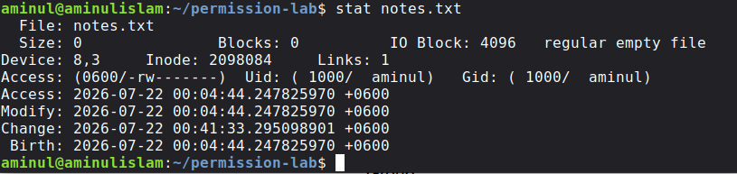

---

### 17. Display Current User, User ID and Groups (`whoami`, `id`, `groups`)

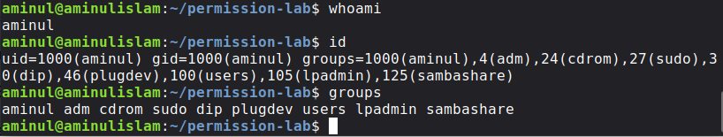

---

### 18. Create a Directory and Verify the Current Working Directory

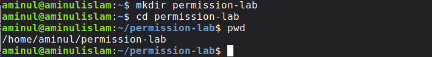

## Skills Developed

- Linux permission management
- Symbolic permissions (chmod)
- Numeric permissions (chmod)
- File ownership (chown)
- Group ownership (chgrp)
- User and group identification
- Access control concepts
- Terminal troubleshooting
- Reading Linux permission strings
- Security-oriented thinking

## Related Commands

```ls -l
ls -ld
chmod
chown
chgrp
whoami
id
groups
stat
cat
sudo
```

## Reflection

Before this lab, I recognized permission strings such as -rw-r--r-- but did not fully understand their meaning. By creating files, modifying permissions, changing ownership, and observing the effects, I developed a much clearer understanding of Linux access control. The mistakes I made reinforced the importance of reading terminal messages carefully and understanding how Linux responds to incorrect commands. This practical experience strengthened both my Linux administration skills and my cybersecurity mindset.

## Next Step

In the next lesson, I will explore Linux users and groups in greater depth. I will learn how Linux manages user accounts, where user information is stored, and how group memberships influence system permissions.

## References

- man chmod
- man chown
- man chgrp
- man stat
- man id
- man groups
- man ls

