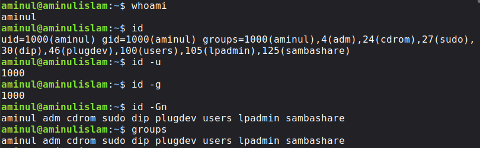
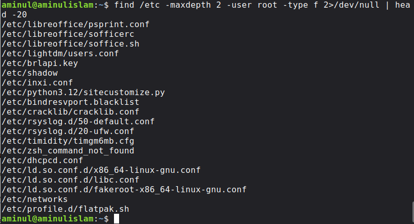
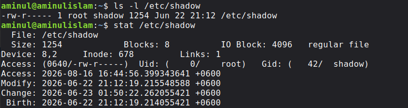
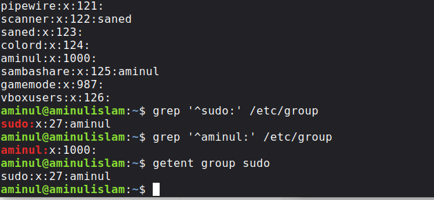
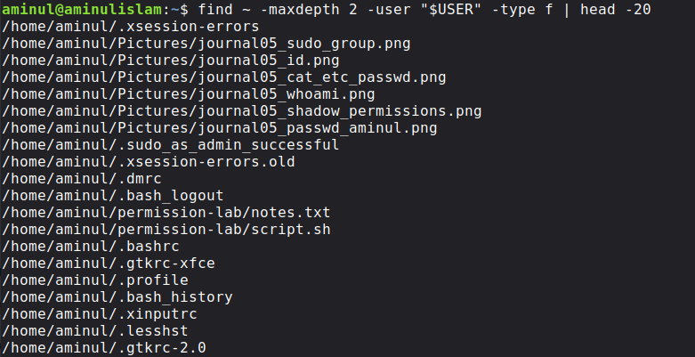

# Linux Users, Groups, Ownership & Access Control

## Objective

The objective of this lab was to understand how Linux identifies users and groups, how those identities relate to file ownership, and how permissions control access to files and directories.

I focused on the relationship between:
```
whoami
   ↓
id
   ↓
groups
   ↓
/etc/passwd
   ↓
/etc/group
   ↓
file ownership
   ↓
permissions
```
I also examined the permissions and metadata of /etc/shadow, one of the system's sensitive authentication-related files.

## Background

Linux is a multi-user operating system.

Instead of treating every person or process as simply "allowed" or "not allowed," Linux associates identities with numerical IDs and groups.

A simplified model is:

```text
User
 │
 ├── UID
 │
 ├── Primary GID
 │
 └── Supplementary Groups
          │
          └── Permissions
                   │
                   └── Files / Directories
```

This matters greatly in cybersecurity.

When investigating a Linux system, I may need to determine:

- Who is the current user?
- What groups does the user belong to?
- Which users exist?
- Which groups exist?
- Who owns a particular file?
- What permissions does the file have?
- Which files belong to a particular user?
- Which sensitive files are owned by root?

Day 5 connected these questions together.

## Environment

### Operating System
`Linux Mint 22.3 (Zena)`

### Shell
`Bash`

### Current user
`aminul`

### Home directory
`/home/aminul`

## Commands Used

The main commands and files examined were:
```Bash
whoami
id
id -u
id -g
id -Gn
groups

cat /etc/passwd
grep '^aminul:' /etc/passwd

cat /etc/group
grep '^sudo:' /etc/group
grep '^aminul:' /etc/group
getent group sudo

ls -l /etc/shadow
stat /etc/shadow

ls -l
stat notes.txt

find ~ -maxdepth 2 -user "$USER" -type f | head -20
find /etc -maxdepth 2 -user root -type f 2>/dev/null | head -20
```
## 1. Identifying the Current User

I started with:

`whoami`

My output was:

`aminul`

This answered a very basic but important question:
   ### Who am I currently operating as?

The answer was:

`aminul`

This becomes especially important before running administrative commands.

## 2. Understanding id

Next:

`id`

My actual output:

```text
uid=1000(aminul) gid=1000(aminul) groups=1000(aminul),4(adm),24(cdrom),27(sudo),30(dip),46(plugdev),100(users),105(lpadmin),125(sambashare)
```
I can break this down into three major parts.
### UID

`uid=1000(aminul)`

My user ID is:

`1000`

and Linux associates that UID with the username:

`aminul`

### Primary group

`gid=1000(aminul)`

My primary group is:

`aminul`

with GID:

`1000`

### Supplementary groups
The remaining memberships include:
```
adm
cdrom
sudo
dip
plugdev
users
lpadmin
sambashare
```
So `id` gives me a much richer picture of my identity than `whoami`.

## 3. Looking at UID and GID Separately

I ran:

`id -u`

Output:

`1000`

Then:

`id -g`

Output:

`1000`

This helped me see that:
```
UID = 1000
Primary GID = 1000
```
I also ran:

`id -Gn`

Output:
```
aminul adm cdrom sudo dip plugdev users lpadmin sambashare
```
This displays the group names associated with my current identity.

## 4. groups

I then ran:

`groups`

Output:
```
aminul adm cdrom sudo dip plugdev users lpadmin sambashare
```
This reinforced what I had already learned from `id`.

A useful mental model is:
```text
whoami
    ↓
username


id
    ↓
UID + GID + groups


groups
    ↓
group memberships
```
## 5. Examining `/etc/passwd`

Next I examined:

`cat /etc/passwd`

The file contains records for system and human user accounts.

My own account appeared as:

`aminul:x:1000:1000:Aminul Islam,,,:/home/aminul:/bin/bash`

This single line contains several fields.

Conceptually:
```text
username
   ↓
password placeholder
   ↓
UID
   ↓
GID
   ↓
GECOS/user information
   ↓
home directory
   ↓
login shell
```
For my account:
```text
Username:      aminul
UID:           1000
GID:           1000
Home:          /home/aminul
Shell:         /bin/bash
```
The `x` field does not mean my password is literally the letter `x`. It indicates that the password information is stored separately rather than in this field.

## 6. Searching for My Account

Instead of reading the entire file, I used:
```Bash
grep '^aminul:' /etc/passwd
```
Output:

`aminul:x:1000:1000:Aminul Islam,,,:/home/aminul:/bin/bash`

This was a useful lesson in targeted investigation.

Instead of:
```Bash
cat /etc/passwd
```
I can search for the specific account I am interested in.

## 7. Examining `/etc/group`

I then examined:
```Bash
cat /etc/group
```
Among the entries, I found:

`sudo:x:27:aminul`

and:

`adm:x:4:syslog,aminul`

I also found:
```text
cdrom:x:24:aminul
dip:x:30:aminul
plugdev:x:46:aminul
users:x:100:aminul
lpadmin:x:105:aminul
sambashare:x:125:aminul
```
This provided another perspective on my group memberships.

## 8. Investigating the `sudo` Group

I specifically searched for:
```Bash
grep '^sudo:' /etc/group
```
Output:

`sudo:x:27:aminul`

I then confirmed it using:
```Bash
getent group sudo
```
Output:

`sudo:x:27:aminul`

This gave me another useful command for querying group information.

## 9. Examining `/etc/shadow`

This was one of the most security-relevant parts of the lab.

I ran:
```Bash
ls -l /etc/shadow
```
My output:

`-rw-r----- 1 root shadow 1254 Jun 22 21:12 /etc/shadow`

I then ran:
```Bash
stat /etc/shadow
```
Important information from the output:
```text
Access: (0640/-rw-r-----)
Uid: (    0/    root)
Gid: (   42/  shadow)
```
So I observed:
```text
Owner: root
Group: shadow
Permissions: 0640
```
The symbolic permissions were:

`-rw-r-----`

Breaking that down:
```text
- rw- r-- ---
│  │   │   │
│  │   │   └── others
│  │   └────── group
│  └────────── owner
└───────────── regular file
```
This is a powerful example of Linux access control in practice.

## 10. Comparing File Ownership

I returned to my practice directory:
```Bash
cd ~/permission-lab
```
Then:
```Bash
ls -l
```
Output:
```
-rw-r--r-- 1 aminul aminul    0 Jul 22 00:04 notes.txt
drwxrwxr-x 2 aminul aminul 4096 Jul 22 00:05 reports
-rwxr-xr-x 1 aminul aminul    0 Jul 22 00:05 script.sh
```
I could now interpret the ownership information:
```
notes.txt
Owner: aminul
Group: aminul


reports
Owner: aminul
Group: aminul


script.sh
Owner: aminul
Group: aminul
```
This connected directly to the previous day's work on permissions.

## 11. Using stat for Detailed Metadata

I examined:
```Bash
stat notes.txt
```
Relevant output:
```
Access: (0644/-rw-r--r--)
Uid: ( 1000/  aminul)
Gid: ( 1000/  aminul)
```
So:
```
UID 1000 → aminul
GID 1000 → aminul
```
And the file permissions were:

`0644`

or:

`-rw-r--r--`

This was a nice moment where several concepts finally connected:
```text
id
 ↓
UID/GID
 ↓
file ownership
 ↓
permissions
```

## 12. Finding Files Owned by Me

I used:
```Bash
find ~ -maxdepth 2 -user "$USER" -type f | head -20
```
Among the results were:
```
/home/aminul/permission-lab/notes.txt
/home/aminul/permission-lab/script.sh
```
This demonstrates how ownership information can be used as an investigation filter.

Instead of simply asking:

   "What files exist?"

I can ask:

   "Which files are owned by this particular user?"

That distinction is important in security work.

## 13. Finding Root-Owned Files

I then searched `/etc`:
```Bash
find /etc -maxdepth 2 -user root -type f 2>/dev/null | head -20
```
The command returned examples including:
```
/etc/shadow
/etc/lightdm/users.conf
/etc/rsyslog.d/50-default.conf
/etc/dhcpcd.conf
/etc/networks
```
This showed me that ownership can also be used to investigate system configuration.

## Observations & Findings

Several things became much clearer during this lab.

### 1. A username is not the complete identity

Linux also works with numerical identifiers:
```
UID
GID
```
### 2. Users can belong to multiple groups

My account belongs to:
```
aminul
adm
cdrom
sudo
dip
plugdev
users
lpadmin
sambashare
```
### 3. Ownership and permissions are connected

For example:

`-rw-r--r-- 1 aminul aminul ...`

contains both:
```
owner = aminul
group = aminul
```
and:

`permissions = rw-r--r--`

### 4. Sensitive files require particular attention

`/etc/shadow` showed:
```
root:shadow
0640
```
rather than ordinary user ownership.

### 5. `find` can turn ownership into an investigation technique

I can search for:

`files owned by me`

or:

`files owned by root`

rather than manually inspecting everything.

## Key Concepts Learned

My key concepts from Day 5 were:

### UID

A numerical identifier representing a Linux user.

### GID

A numerical identifier representing a group.

### Primary group

The user's main group association.

### Supplementary groups

Additional groups to which the user belongs.

`/etc/passwd`

Contains account information such as usernames, UIDs, GIDs, home directories and login shells.

`/etc/group`

Contains group definitions and group membership information.

`/etc/shadow`

Contains sensitive password/account-aging information and is protected by restrictive permissions.

### Ownership

Every file has an owner and group.

### Permissions

Linux controls access using read, write and execute permissions.

## Security Perspective

This was one of the most security-oriented days of Week 5.

When investigating a Linux machine, knowing who owns what can be just as important as knowing what files exist.

An analyst may investigate:

- unexpected users
- unexpected group memberships
- suspicious ownership changes
- sensitive configuration files
- authentication-related files
- files owned by root
- files owned by unexpected accounts
- potentially suspicious files in user directories

The important idea I learned is:

   ### Identity, ownership and permissions form part of Linux's access-control model.

A suspicious file becomes much more interesting when I know:
```
Who owns it?
Which group owns it?
What permissions does it have?
Which user is currently running the process?
```
This is the bridge between basic Linux administration and security investigation.

## Mistakes I Made (Learning Moments)

Interestingly, I did not make a command-typing mistake during this day's main exercise.

I deliberately followed the commands carefully and checked the outputs.

But that itself taught me something.

Earlier in Week 5, I had made several small mistakes such as:
```
cd~
cd..
mddir
ch
```
Those mistakes happened because Linux commands are precise.

But now, I have slowed down and followed the commands carefully.

### Learning moment

There is nothing wrong with copying a command while learning.

But the long-term goal is not:

   "Can I copy the command?"

It is:

   "Do I understand what the command is asking Linux to do?"

That distinction matters.

## Screenshots

### 1. User Identity (`whoami`)



---

### 2. Identity, Permissions, and Connection

.png)

---

### 3. User Password and Account Information


---

### 4. Root-Owned Files



---

### 5. `/etc/shadow` Metadata



---

### 6. Sudo Group Membership



---

### 7. User-Owned Files



## Skills Developed

During this lab I practiced:

- identifying the current Linux user
- reading UID and GID information
- identifying group memberships
- examining /etc/passwd
- searching account information with grep
- examining /etc/group
- querying groups with getent
- inspecting /etc/shadow permissions
- reading file ownership
- reading detailed metadata with stat
- searching files by owner
- identifying root-owned files
- connecting identity with permissions
- thinking about Linux from an incident-response perspective

## Related Commands

Commands I will encounter again later include:
```
whoami
id
groups
getent
passwd
chage
usermod
groupadd
groupdel
chmod
chown
chgrp
stat
ls -l
find
```
I don't need to memorize all of them today.

The important thing is that I now know what category of problem each command helps solve.

## Reflection

Today's lesson was less about memorizing commands and more about connecting ideas.

At first, this looked like a collection of unrelated commands:
```
whoami
id
groups
cat
grep
getent
ls
stat
find
```
But after working through them, I began to see a relationship:
```
Who am I?
     ↓
What is my UID?
     ↓
What groups do I belong to?
     ↓
What does Linux know about my account?
     ↓
Who owns this file?
     ↓
What permissions does it have?
     ↓
Can this user access it?
```
That is a much more useful way for me to remember Linux.

And I am beginning to understand something important about learning cybersecurity:

I don't need to remember the entire ocean. I need to learn how to read the map.

## Next Step

The next stage is to move deeper into Linux permissions and access control.

I will continue practicing:
```
users
   ↓
groups
   ↓
ownership
   ↓
permissions
   ↓
access
```
before moving toward more advanced filesystem and security concepts.

## References

For this journal, the primary evidence is my own Linux Mint 22.3 terminal session.

Useful system documentation can also be consulted through:
```
man id
man groups
man passwd
man group
man getent
man chmod
man chown
man stat
man find
```
