# Lesson 08 — Linux Package Management

## Objective

In this lesson, I learned how Linux manages software through packages.

My goals were to understand:

- what APT is and how it relates to `dpkg`
- where package repositories are configured
- how to refresh package information
- how to search for packages
- how to inspect a package before installing it
- how to install and remove a package
- how to inspect dependencies
- how to identify manually and automatically installed packages
- how to inspect installed packages
- how to check available upgrades
- how to clean the APT package cache
- how to recognize and document package-management errors
- why package management is also a security issue


## Background

Before this lesson, I mainly thought of software installation as:

> Find a program → install it → use it.

Linux made me look at the process differently.

A package is not just a program. It can also have dependencies, configuration files, version information, repository information, installation status, and relationships with other packages.

On a Debian/Ubuntu/Linux Mint system, APT provides the high-level package-management interface, while `dpkg` is the lower-level Debian package database and package-management tool. APT can resolve dependencies and work with repositories; `dpkg` works directly with Debian packages and the local package database.

This distinction became much clearer during this lesson.


## Environment

I performed the practical work on my primary Linux Mint learning machine.

```text
User: aminul
Hostname: aminulislam
OS: Linux Mint 22.3 (Zena)
Base: Ubuntu 24.04 (noble)
Architecture: amd64
APT: 2.8.3 (Mint wrapper)
Kernel: 6.17.0-40-generic
```

Evidence from my terminal:

```text
$ cat /etc/os-release
NAME="Linux Mint"
VERSION="22.3 (Zena)"
ID=linuxmint
ID_LIKE="ubuntu debian"
PRETTY_NAME="Linux Mint 22.3"
VERSION_ID="22.3"
VERSION_CODENAME=zena
UBUNTU_CODENAME=noble

$ apt --version
apt 2.8.3 (amd64) (Mint wrapper)
```

# 1. Understanding Package Sources

Before installing software, I wanted to know where my system gets package information.

I first checked the traditional file:

```bash
grep -v '^#' /etc/apt/sources.list 2>/dev/null
```

There was no useful output.

Then I accidentally typed the directory itself:

```bash
/etc/apt/sources.list.d/
```

The terminal responded:

```text
bash: /etc/apt/sources.list.d/: Is a directory
```

That was useful because the error explained exactly what I had done wrong.

I then listed the directory correctly:

```bash
ls -l /etc/apt/sources.list.d/
```

My system contained:

```text
-rw-r--r-- 1 root root 188 Jun 23 00:27 brave-browser-release.sources
-rw-r--r-- 1 root root 334 Sep  1 07:36 google-chrome.sources
-rw-r--r-- 1 root root 432 Aug 31 23:38 official-package-repositories.list
```

I also inspected the active repository entries:

```bash
grep -Rhv '^#' /etc/apt/sources.list.d/ 2>/dev/null
```

Among the entries I observed were the Linux Mint repository, Ubuntu Noble repositories, Ubuntu security repositories, Google Chrome, and Brave.

One important detail was:

```text
Signed-By: /usr/share/keyrings/google-chrome.gpg
```

and:

```text
Signed-By: /usr/share/keyrings/brave-browser-archive-keyring.gpg
```

### Security Perspective

Package sources are part of the system's trust chain.

If I add an untrusted repository, I am not simply adding a convenient download location. I am changing where software and updates can come from.

So I should always ask:

1. Who controls this repository?
2. Is it an official source?
3. Is the package actually needed?
4. What signing/key mechanism is configured?
5. Is there a safer official package available?


# 2. Refreshing the Package Index

I ran:

```bash
sudo apt update
```

My system contacted several configured repositories.

The important ending was:

```text
Fetched 249 kB in 3s (79.4 kB/s)
Reading package lists... Done
Building dependency tree... Done
Reading state information... Done
1 package can be upgraded. Run 'apt list --upgradable' to see it.
```

### What `apt update` actually does

It does not normally upgrade the installed software.

It refreshes the local information about what packages and versions are available from the configured repositories.

A simple way to remember it:

```text
apt update
     ↓
"Tell me what is available."

apt upgrade
     ↓
"Now install available upgrades."
```

That distinction is important.


# 3. Checking Available Upgrades

I ran:

```bash
apt list --upgradable
```

At that point, the output showed:

```text
python3-pil/noble-updates,noble-security 10.2.0-1ubuntu1.3 amd64
[upgradable from: 10.2.0-1ubuntu1.2]
```

Later in the lesson, the list changed and showed eight packages, including:

```text
libevent-2.1-7t64
libgcrypt20
libncurses6
libncursesw6
libtinfo6
ncurses-base
ncurses-bin
python3-pil
```

The important lesson was that package availability can change after repository information is refreshed.


# 4. Searching for Packages

I searched for `curl`:

```bash
apt search curl
```

The result contained many packages related to curl, including:

```text
curl - command line tool for transferring data with URL syntax
```

I also searched for `htop`:

```bash
apt search htop
```

and saw:

```text
p   bashtop  - Resource monitor that shows usage and stats
i   htop     - interactive processes viewer
```

The `i` indicator was useful evidence that `htop` was installed at that point in my session.

I also tried:

```bash
apt search process monitor
```

This produced a very large result because APT searches package information broadly.

### Documentation lesson

A command can be technically correct but still produce too much information.

Good documentation should therefore explain not only:

> "Run this command."

but also:

> "Here is what to look for in the output."


# 5. Inspecting a Package Before Installing It

I examined `htop` with:

```bash
apt show htop
```

Important information included:

```text
Package: htop
Version: 3.3.0-4build1
Priority: optional
Section: utils
Origin: Ubuntu
Installed-Size: 434 kB
Download-Size: 171 kB
APT-Manual-Installed: yes
APT-Sources: http://archive.ubuntu.com/ubuntu noble/main amd64 Packages
```

The description identified it as an interactive process viewer.

I also checked its dependencies:

```bash
apt depends htop
```

The output included:

```text
Depends: libc6
Depends: libncursesw6
Depends: libnl-3-200
Depends: libnl-genl-3-200
Depends: libtinfo6
```

`apt-cache` gave the same dependency information:

```bash
apt-cache depends htop
```

This helped me understand that installing one program may involve several other packages.


# 6. Installing `htop`

I checked whether the package was installed:

```bash
command -v htop
```

At one point I got:

```text
/usr/bin/htop
```

But then:

```bash
dpkg -s htop
```

reported:

```text
dpkg-query: package 'htop' is not installed and no information is available
```

and:

```bash
dpkg -l htop
```

reported:

```text
dpkg-query: no packages found matching htop
```

This was an important lesson:

> Finding a command path and confirming package database status are not the same check.

I then installed it:

```bash
sudo apt install htop
```

APT downloaded:

```text
171 kB
```

and installed:

```text
htop 3.3.0-4build1
```

Afterward:

```bash
dpkg -s htop | grep '^Status:'
```

gave:

```text
Status: install ok installed
```

And:

```bash
htop --version
```

gave:

```text
htop 3.3.0
```

# 7. A Very Important Real-World Problem I Encountered

The most valuable part of this lesson was not the successful installation.

It was the error that appeared during package configuration.

While installing/removing `htop` and later running package-management commands, my system repeatedly reported a DKMS failure involving VirtualBox:

```text
Error! Bad return status for module build on kernel: 7.0.0-29-generic
```

and:

```text
dkms autoinstall on 7.0.0-29-generic/x86_64 failed for virtualbox(10)
```

The same pattern appeared for kernels:

```text
7.0.0-28-generic
7.0.0-29-generic
7.0.0-30-generic
```

APT/dpkg also reported:

```text
8 not fully installed or removed.
```

and eventually:

```text
E: Sub-process /usr/bin/dpkg returned an error code (1)
```

### What I learned

This did **not** mean that `htop` itself was necessarily broken.

The terminal showed that `htop` was successfully configured:

```text
Setting up htop (3.3.0-4build1) ...
```

The package transaction was also exposing a separate problem involving VirtualBox's DKMS module and kernel configuration.

That distinction matters enormously in troubleshooting.

A good technical writer should not write:

> "htop failed."

when the evidence actually says:

> "htop was installed, but the broader package transaction also encountered an unrelated DKMS/VirtualBox configuration failure."

That is a much more accurate diagnosis.


# 8. Checking Package Status

I used:

```bash
dpkg -s htop | grep -E '^(Package|Status|Version|Architecture):'
```

My output was:

```text
Package: htop
Status: install ok installed
Architecture: amd64
Version: 3.3.0-4build1
```

I also inspected Bash:

```bash
dpkg -l bash
```

The important status line was:

```text
ii  bash  5.2.21-2ubuntu4  amd64  GNU Bourne Again SHell
```

The `ii` status is useful evidence that the package is installed and configured.

I also checked the package that owns a file:

```bash
dpkg -S /usr/bin/bash
```

Output:

```text
bash: /usr/bin/bash
```

This answers a very practical question:

> Which package installed this file?


# 9. Counting Installed Packages

I ran:

```bash
dpkg -l | grep '^ii' | wc -l
```

My system reported:

```text
2051
```

So, according to this particular check at this particular time, my system had 2051 packages in the installed/configured `ii` state.

This number is not a universal Linux number. It is evidence from my own machine.

That distinction is important in technical writing.


# 10. Manual vs Automatic Packages

I checked automatically installed packages:

```bash
apt-mark showauto | head -20
```

Examples included:

```text
brave-keyring
cabextract
fonts-freefont-ttf
git-man
gjs
gparted-common
...
```

Then I checked manually installed packages:

```bash
apt-mark showmanual | head -20
```

Examples included:

```text
7zip
accountsservice
acl
adduser
adwaita-icon-theme
...
apt
apt-utils
aptdaemon
```

### Why this matters

When I explicitly install a package, it can be marked as manually installed.

Dependencies installed because another package needs them can be marked as automatically installed.

That relationship helps APT identify packages that may no longer be needed.


# 11. Removing `htop`

I tested the reverse operation:

```bash
sudo apt remove htop
```

APT told me:

```text
The following packages will be REMOVED:
  htop
```

and:

```text
After this operation, 434 kB disk space will be freed.
```

I confirmed with:

```text
y
```

The package was removed.

However, the same pre-existing DKMS/VirtualBox errors appeared during the broader package configuration work.

This reinforced another lesson:

> A package operation can trigger other package-management tasks.

So I should always read the complete transaction output instead of looking only for the package name I typed.


# 12. `apt clean` and the Package Cache

I checked the size of the APT archive cache:

```bash
du -sh /var/cache/apt/archives/
```

I got:

```text
1.1G    /var/cache/apt/archives/
```

I then ran:

```bash
sudo apt clean
```

Afterward:

```bash
du -sh /var/cache/apt/archives/
```

showed:

```text
40K     /var/cache/apt/archives/
```

This was one of the clearest pieces of evidence in the lesson.

### What happened?

`apt clean` removed cached package archives from the local APT cache.

It did not uninstall my installed software.

I learned this by measuring the cache before and after.


# 13. `apt autoclean`

I also ran:

```bash
sudo apt autoclean
```

It completed with:

```text
Reading package lists... Done
Building dependency tree... Done
Reading state information... Done
```

The important difference is that `autoclean` is more selective than `clean`; it removes cached package files that are no longer useful/downloadable.


# 14. Checking Package Versions and Candidates

I first made a mistake:

```bash
apt policy version
```

There was no useful result because `version` was not the package I intended to inspect.

I corrected myself with:

```bash
apt policy htop
```

My output showed:

```text
htop:
  Installed: 3.3.0-4build1
  Candidate: 3.3.0-4build1
  Version table:
 *** 3.3.0-4build1 500
        500 http://archive.ubuntu.com/ubuntu noble/main amd64 Packages
        100 /var/lib/dpkg/status
```

I also checked:

```bash
apt-cache policy htop
```

and obtained the same package/version information.

This taught me that `apt policy` is useful for answering questions such as:

> What version is installed?

> What version would APT currently choose?

> Which repository provides that candidate?


# 15. Searching Installed Packages with Pipes

I used:

```bash
apt list --installed 2>/dev/null | grep -i network | head -20
```

This showed installed packages related to networking.

I also searched for SSH-related packages:

```bash
apt list --installed 2>/dev/null | grep -i ssh
```

My system showed packages including:

```text
libssh-4
libssh-gcrypt-4
libssh2-1t64
openssh-client
```

This was another connection between Linux CLI skills and cybersecurity.

Instead of opening a graphical software manager and scrolling through thousands of packages, I could ask a precise question from the terminal.


# 16. APT vs DPKG — The Mental Model I Want to Remember

The simplest model I now use is:

```text
Repositories
     ↓
    APT
     ↓
Dependency resolution + package acquisition
     ↓
   dpkg
     ↓
Install/configure package
     ↓
Local package database
```

This is simplified, but it gives me a useful working model.

APT is the higher-level interface I use for normal repository-based package management.

`dpkg` is the lower-level Debian package-management tool and database.


# 17. Troubleshooting Package Problems

I checked:

```bash
dpkg --audit
```

Without root privileges, I received:

```text
dpkg: error: unable to check lock file for dpkg database directory
/var/lib/dpkg: Permission denied
```

I then checked with:

```bash
sudo apt-get check
```

The output completed without reporting a dependency error:

```text
Reading package lists... Done
Building dependency tree... Done
Reading state information... Done
```

However, my earlier package transactions had clearly reported:

```text
8 not fully installed or removed.
```

and DKMS/VirtualBox configuration failures.

So I learned an important troubleshooting principle:

> One successful diagnostic command does not automatically erase evidence from earlier failures.

I need to consider the whole sequence of evidence.


# Mistakes I Made (Learning Moments)

### 1. I typed a directory as if it were a command

```bash
/etc/apt/sources.list.d/
```

Result:

```text
bash: /etc/apt/sources.list.d/: Is a directory
```

The lesson:

> A path is not automatically a command.

I should inspect a directory with commands such as `ls`, `find`, `cat` for a file, or another appropriate tool.


### 2. I used `apt policy version`

```bash
apt policy version
```

I had not supplied the actual package name I wanted.

The correction was:

```bash
apt policy htop
```

The lesson:

> Read the command syntax before pressing Enter.


### 3. I tried to read a file before creating it

Inside my practice directory:

```bash
cat notes.txt
```

returned:

```text
cat: notes.txt: No such file or directory
```

I then created the file by redirecting output:

```bash
apt --version >> notes.txt
```

and verified it:

```bash
cat notes.txt
```

Output:

```text
apt 2.8.3 (amd64) (Mint wrapper)
```

The lesson:

> Error messages are often instructions in disguise.


### 4. I encountered a real package-management failure

The VirtualBox DKMS module failed to build against several kernel versions.

Instead of hiding the error, I documented it.

This was probably the most valuable learning moment of the lesson.


# Security Perspective

Package management is directly connected to cybersecurity.

### 1. Software supply chain

My system depends on repositories and package metadata.

A malicious or compromised repository could become a supply-chain risk.

### 2. Updates

Security fixes are commonly delivered through package updates.

Therefore:

```bash
sudo apt update
```

is not the same thing as installing security updates. It refreshes the package information.

### 3. Third-party repositories

My system contained third-party repository entries for applications such as Chrome and Brave.

I learned to treat additional repositories as trust decisions rather than simply convenient software sources.

### 4. Dependencies

A package can bring additional software onto the system.

Therefore, installing software means understanding not only the main package but also its dependencies.

### 5. Package inventory

Knowing what is installed helps with security auditing.

For example:

```bash
dpkg -l
```

and:

```bash
apt list --installed
```

can help establish a software inventory.

### 6. Unexpected package changes

If package-management output shows something unexpected, I should investigate before accepting it blindly.

A professional habit is:

> Read the proposed changes before confirming them.


## Screenshots

### 1. Update Package Lists (`apt update`)

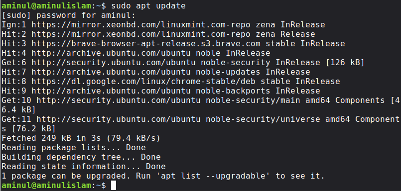

---

### 2. Check Package Dependencies

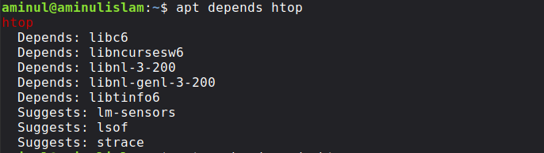

---

### 3. Check Package Status (`dpkg`)

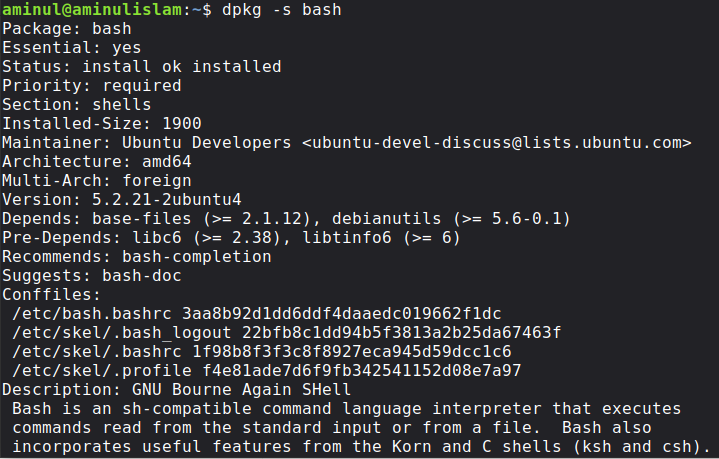

---

### 4. Check File Ownership (`dpkg`)

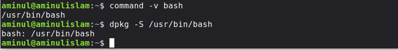

---

### 5. Monitor System Processes with `htop`

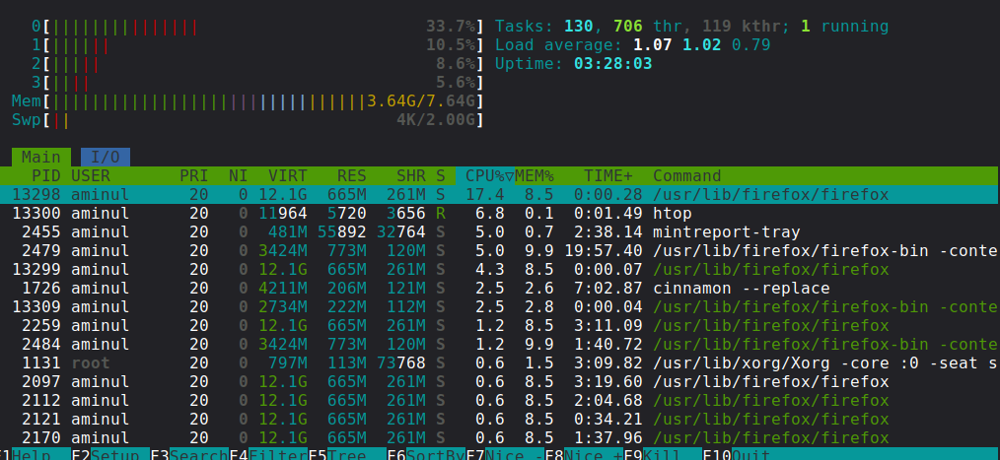

---

### 6. Count Installed Packages

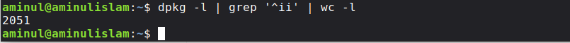

---

### 7. Verify Package Installation

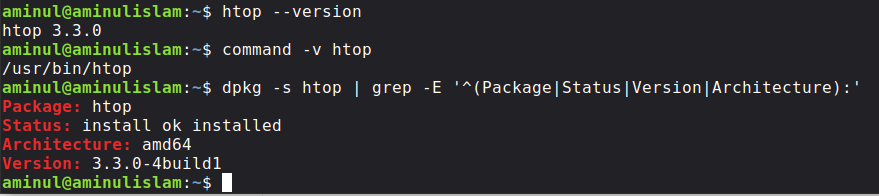

---

### 8. View Package Details

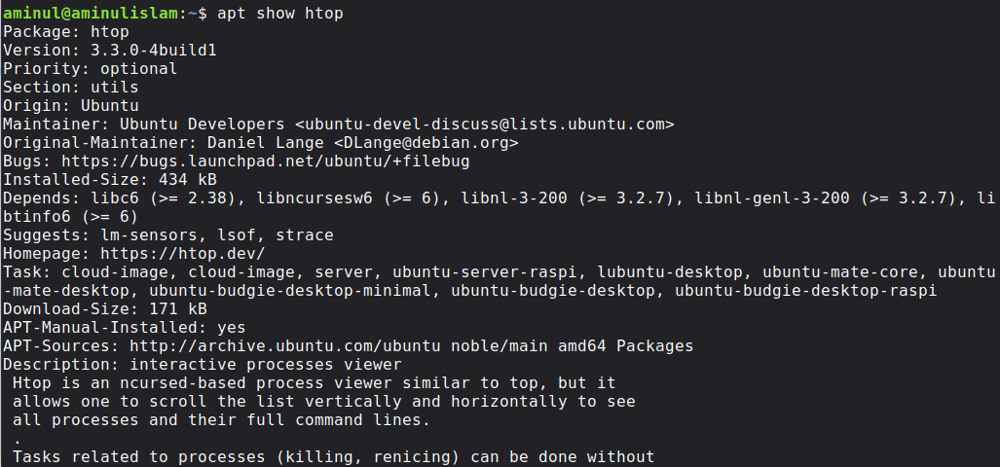

---

### 9. View Package Marks

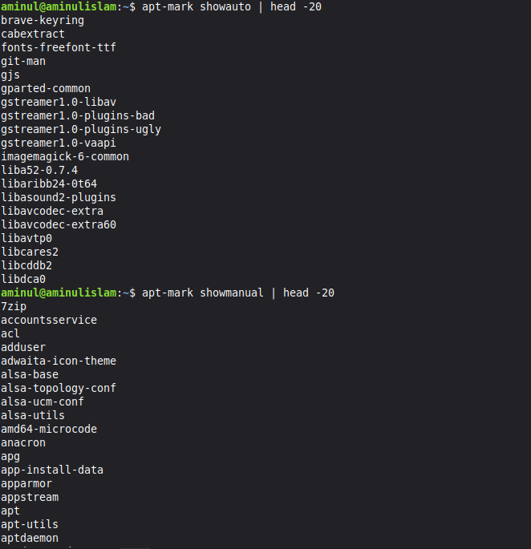

---

### 10. View Package Policy

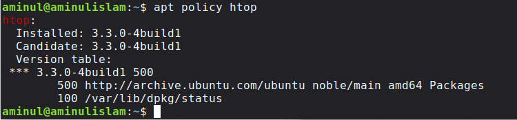

---

### 11. Search for Packages

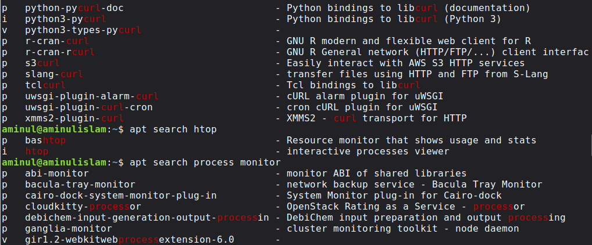

---

### 12. Check System Environment

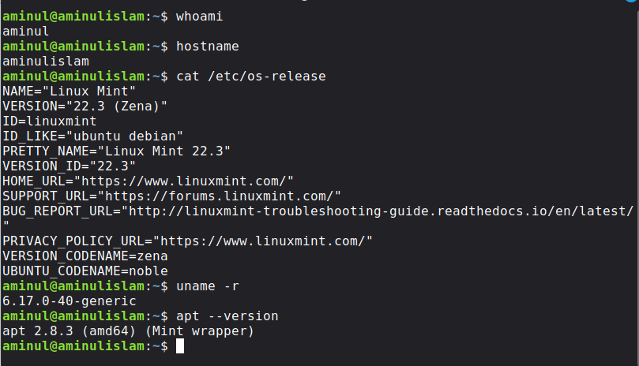

---

### 13. Upgrade Packages


# Skills Developed

- APT package management
- `dpkg` package inspection
- Repository inspection
- Package searching
- Package metadata analysis
- Dependency analysis
- Package installation and removal
- Package-status verification
- Manual vs automatic package identification
- Package-cache management
- Package troubleshooting
- Reading long terminal output
- Evidence-based technical documentation
- Linux software inventory
- Security-oriented package management


# Related Commands

```bash
apt --version
apt update
apt search <package>
apt show <package>
apt depends <package>
apt policy <package>
apt install <package>
apt remove <package>
apt autoremove
apt clean
apt autoclean
apt list --installed
apt list --upgradable

apt-mark showauto
apt-mark showmanual

apt-cache policy <package>
apt-cache depends <package>

dpkg -l
dpkg -s <package>
dpkg -S <file>
dpkg --audit

command -v <command>

grep
head
less
wc
du
```

# Reflection

This lesson changed the way I think about installing software.

I started with the simple idea:

> "I want a program, so I install it."

I finished with a much bigger picture.

I now see repositories, package indexes, versions, dependencies, package states, local databases, caches, and configuration tasks.

The most valuable part was the failure.

My system repeatedly reported a VirtualBox DKMS build failure while working with newer kernel packages. Instead of treating the red error messages as something to ignore, I learned to separate the evidence:

- `htop` itself reached `install ok installed`
- the broader package transaction also contained DKMS failures
- several kernel-related packages remained not fully configured

That is exactly the kind of distinction I want to make when writing cybersecurity documentation.

I do not want to write what I *think* happened.

I want to document what the evidence actually shows.


# Next Step

Lesson 08 taught me how Linux gets, installs, removes, verifies, and tracks software.

The next lesson will move from package management into Bash fundamentals.

I will begin connecting individual commands together using:

- pipes
- redirection
- variables
- command substitution
- exit status
- simple Bash scripts

This is where Linux CLI knowledge starts turning into automation.


## References

- `man apt`
- `man apt-get`
- `man apt-mark`
- `man dpkg`
- `man dpkg-query`
- Ubuntu documentation on package management
- Debian APT documentation
- Linux Mint documentation


## Evidence Note

All package versions, repository entries, package counts, cache sizes, and error messages documented above are from my own Linux Mint terminal session. They are not universal values.

That distinction matters in technical documentation.
