# Lesson 09 — Bash and Shell Scripting

## Objective

In this lesson, I learned the basics of Bash and started using it for simple automation.

I learned how to:

- Check which shell I am using
- Create and run a Bash script
- Make a script executable
- Use variables
- Take input from a user
- Use positional parameters such as `$1` and `$2`
- Check the exit status of a command with `$?`
- Use `if` conditionals
- Use `for` loops
- Redirect output with `>` and `>>`
- Connect commands with a pipe `|`
- Understand the difference between single and double quotes
- Build simple system-checking and security-oriented scripts
- Combine several Bash ideas into a small automation project
- Troubleshoot Bash scripts using `bash -n`

This lesson also taught me something that is very important in technical work: a tiny spelling or capitalization mistake can stop a script from working.


## Background

Bash is a shell. A shell is a program that lets me communicate with the operating system through commands.

A simple way to picture it is:

```text
Me
 ↓
Terminal
 ↓
Bash
 ↓
Linux
 ↓
Computer
```

Bash can do more than run one command at a time. It can also put commands together in a script, make decisions, repeat tasks, accept input, and automate routine work.

That makes Bash especially useful for Linux administration, cybersecurity work, documentation tasks, and automation.


## Environment

The practical work was performed on my Linux system.

### Shell

```text
/bin/bash
```

My terminal also reported:

```text
bash
```

when I checked `$0`.

### Working directory

For part of the practice I created:

```text
/home/aminul/bash-lab
```

However, several later scripts were created in my home directory:

```text
/home/aminul
```

This difference became an important learning point when I tried to use `hello.sh` from the wrong directory.


# 1. Checking My Shell

I started by checking which shell I was using.

```bash
echo $SHELL
```

My output was:

```text
/bin/bash
```

Then I checked:

```bash
echo $0
```

My output was:

```text
bash
```

This confirmed that Bash was the shell I was working with.


# 2. Creating the Bash Lab

I first tried:

```bash
cd ~ mkdir -p bash-lab
```

Bash returned:

```text
bash: cd: too many arguments
```

I had put two commands on one line without separating them.

I then correctly ran:

```bash
cd ~
mkdir -p bash-lab
cd bash-lab
```

Then:

```bash
pwd
```

gave:

```text
/home/aminul
```

inside the lab it became:

```text
/home/aminul/bash-lab
```

I checked the directory with:

```bash
ls -la
```

At that point it was essentially empty apart from `.` and `..`.

### Learning moment

I learned that:

```bash
cd ~
mkdir -p bash-lab
```

are two separate commands. They cannot simply be placed next to each other with a space.


# 3. My First Bash Script

Inside `bash-lab`, I created:

```bash
nano hello.sh
```

The script contained:

```bash
#!/bin/bash

echo "Hello, Aminul!"
echo "I am learning Bash scripting."
echo "Automation begins with small steps."
```

I checked the file:

```bash
cat hello.sh
```

Then I ran it with Bash:

```bash
bash hello.sh
```

My output was:

```text
Hello, Aminul!
I am learning Bash scripting.
Automation begins with small steps.
```

This was my first successful Bash script.


# 4. Making the Script Executable

I checked the permissions:

```bash
ls -l hello.sh
```

The initial output was:

```text
-rw-rw-r-- 1 aminul aminul 115 Sep 13 23:38 hello.sh
```

There was no execute permission.

I added it with:

```bash
chmod +x hello.sh
```

Then:

```bash
ls -l hello.sh
```

The output:

```text
-rwxrwxr-x 1 aminul aminul 115 Sep 13 23:38 hello.sh
```

I could then run:

```bash
./hello.sh
```

The output was again:

```text
Hello, Aminul!
I am learning Bash scripting.
Automation begins with small steps.
```

### What I learned

There are two useful ways to run a script:

```bash
bash hello.sh
```

and, after making it executable:

```bash
./hello.sh
```

The `x` in the permissions represents execute permission.


# 5. Bash Variables

I practiced storing information in variables.

```bash
NAME="Aminul"
```

Then:

```bash
echo "$NAME"
```

gave:

```text
Aminul
```

I created another variable:

```bash
ROLE="Cybersecurity Documentation and Automation Learner"
```

Then:

```bash
echo "$ROLE"
```

gave:

```text
Cybersecurity Documentation and Automation Learner
```

I also combined text and variables:

```bash
echo "My name is $NAME"
```

Output:

```text
My name is Aminul
```

And:

```bash
echo "At present, I am a $ROLE"
```

Output:

```text
At present, I am a Cybersecurity Documentation and Automation Learner
```

A variable is like a small labeled box that stores a value.

For example:

```text
NAME
 ↓
Aminul
```

# 6. Creating a Variables Script

I created:

```bash
nano variables.sh
```

I made it executable:

```bash
chmod +x variables.sh
```

Then ran:

```bash
./variables.sh
```

My output was:

```text
Name: Aminul
Role: Cybersecurity Documentation and Automation Learner
Current directory: /home/aminul
```

This showed me that a script can use variables and also use information already provided by the shell, such as `$PWD`.


# 7. User Input

I first experimented with:

```bash
read
```

but I stopped it with:

```text
^C
```

because `read` was waiting for input.

I then created:

```bash
nano user-input.sh
```

The script asked for my name.

When I ran:

```bash
./user-input.sh
```

I first got:

```text
What is your name?
```

I entered:

```text
Aminul
```

and received:

```text
Hello, Aminul!
```

I then improved the script so that it used a prompt on the same line.

Running it gave:

```text
What is your name? Aminul
Hello, Aminul!
Welcome to Bash scripting.
```

### What I learned

The `read` command allows a Bash script to receive information from the user.


# 8. Positional Parameters

I learned that information can also be supplied when starting a script.

I initially tried:

```bash
./greet.sh Aminul
```

and received:

```text
bash: ./greet.sh: No such file or directory
```

I also tried:

```bash
./script.sh Aminul Linux
```

and received:

```text
bash: ./script.sh: No such file or directory
```

The files did not exist yet.

I then created:

```bash
nano greet.sh
```

made it executable, and ran:

```bash
./greet.sh Aminul Linux
```

The output was:

```text
Hello, Aminul!
Welcome to Linux.
```

I then tested:

```bash
./greet.sh Aminul Cybersecurity
```

and got:

```text
Hello, Aminul!
Welcome to Cybersecurity.
```

This helped me understand positional parameters:

```text
$1 = first argument
$2 = second argument
```

So:

```bash
./greet.sh Aminul Linux
```

means:

```text
$1 = Aminul
$2 = Linux
```

This is useful for automation because a script can receive different information each time it runs.


# 9. Exit Status

One of the most useful Bash ideas I learned was the exit status.

The special variable:

```bash
$?
```

contains the exit status of the command that ran immediately before it.

I first ran:

```bash
pwd
```

Then:

```bash
echo $?
```

My output was:

```text
0
```

That means the previous command succeeded.

I then ran:

```bash
ls file-that-does-not-exist
```

The command produced:

```text
ls: cannot access 'file-that-does-not-exist': No such file or directory
```

Then:

```bash
echo $?
```

gave:

```text
2
```

So I learned the basic idea:

```text
0       = success
non-zero = failure
```

The exact non-zero value can depend on the command.


## Why `$?` must be checked immediately

I tested this too.

When I ran:

```bash
ls missing-file
echo $?
```

I received:

```text
ls: cannot access 'missing-file': No such file or directory
2
```

But when I did:

```bash
ls missing-file
echo "Hello"
echo $?
```

I got:

```text
ls: cannot access 'missing-file': No such file or directory
Hello
0
```

The final `0` belonged to:

```bash
echo "Hello"
```

not to the failed `ls`.

This was an important lesson:

> If I want to check the exit status of a command, I should check `$?` immediately after that command.


# 10. Conditionals

My first attempt at the `if` scripts failed.

I received:

```text
./check-file.sh: line 9: syntax error: unexpected end of file
```

and the directory version produced:

```text
./check-directory.sh: line 10: syntax error: unexpected end of file
```

The cause was a capitalization mistake in the earlier practice instructions: Bash syntax requires the closing keywords:

```bash
fi
```

and:

```bash
done
```

in lowercase.

I corrected the script.

The correct structure is:

```bash
if [ condition ]
then
    command
else
    command
fi
```

Bash is case-sensitive, so:

```text
fi
```

and:

```text
Fi
```

are not the same.


# 11. Checking Whether a File Exists

I created:

```bash
nano check-file.sh
```

with:

```bash
#!/bin/bash

if [ -f "hello.sh" ]
then
    echo "hello.sh exists."
else
    echo "hello.sh does not exist."
fi
```

I checked the syntax with:

```bash
bash -n check-file.sh
```

There was no output, which meant Bash did not report a syntax error.

I then ran:

```bash
./check-file.sh
```

The result was:

```text
hello.sh does not exist.
```

This was not a script failure. It was a correct result because `hello.sh` was inside:

```text
/home/aminul/bash-lab
```

while `check-file.sh` was in:

```text
/home/aminul
```

I had moved back to my home directory before running the check.

This became another useful lesson:

> A relative filename such as `hello.sh` is looked for in the current directory.

I then tested the missing-file case using:

```bash
[ -f "missing.sh" ]
```

and received:

```text
missing.sh does not exist.
```


# 12. Checking Whether a Directory Exists

I created:

```bash
nano check-directory.sh
```

with:

```bash
#!/bin/bash

if [ -d "$HOME" ]
then
    echo "Your home directory exists."
else
    echo "Something is wrong."
fi
```

I checked the syntax:

```bash
bash -n check-directory.sh
```

Then made it executable:

```bash
chmod +x check-directory.sh
```

Running:

```bash
./check-directory.sh
```

gave:

```text
Your home directory exists.
```

I also checked:

```bash
echo "$HOME"
```

and got:

```text
/home/aminul
```

Then:

```bash
ls -ld "$HOME"
```

gave:

```text
drwxr-x--- 20 aminul aminul 12288 Sep 14 22:03 /home/aminul
```

So I could see that `$HOME` really was a directory.


# 13. My First `for` Loop

My first loop also needed correction because the earlier instruction used `Done` instead of the Bash keyword:

```bash
done
```

I corrected it to:

```bash
#!/bin/bash

for ITEM in Linux Bash Cybersecurity Automation
do
    echo "Learning: $ITEM"
done
```

I checked it:

```bash
cat loop.sh
```

Then:

```bash
bash -n loop.sh
```

There was no syntax error.

I made it executable:

```bash
chmod +x loop.sh
```

Then checked:

```bash
ls -l loop.sh
```

My output was:

```text
-rwxrwxr-x 1 aminul aminul 96 Sep 14 22:09 loop.sh
```

Finally:

```bash
./loop.sh
```

gave:

```text
Learning: Linux
Learning: Bash
Learning: Cybersecurity
Learning: Automation
```

The loop took each item one at a time.

```text
ITEM = Linux
ITEM = Bash
ITEM = Cybersecurity
ITEM = Automation
```

The general pattern is:

```bash
for VARIABLE in ITEMS
do
    COMMAND
done
```

# 14. A Practical File Loop

After the corrected loop worked, I tested:

```bash
for FILE in *.sh
do
    echo "Script found: $FILE"
done
```

The output was:

```text
Script found: check-directory.sh
Script found: check-file.sh
Script found: greet.sh
Script found: loop.sh
Script found: user-input.sh
Script found: variables.sh
```

This showed me how a loop can work with files matching a pattern.

It is a simple example of automation: instead of writing a separate command for every script, Bash can process the matching files one by one.


# 15. File Location Matters

At one point I ran:

```bash
cat hello.sh
```

from:

```text
/home/aminul
```

and received:

```text
cat: hello.sh: No such file or directory
```

I then made two incorrect attempts:

```bash
bash-labs
```

which gave:

```text
bash-labs: command not found
```

and:

```bash
cd bash-labs
```

which gave:

```text
bash: cd: bash-labs: No such file or directory
```

The correct directory was:

```text
bash-lab
```

So I ran:

```bash
cd bash-lab
```

and then:

```bash
cat hello.sh
```

The file was there.

### Learning moment

I learned to check my current location with:

```bash
pwd
```

and check available files and directories with:

```bash
ls
```

before assuming a file is missing.


# 16. Output Redirection

I learned that `>` can send command output into a file.

I ran:

```bash
echo "My first Bash output" > output.txt
```

Then:

```bash
cat output.txt
```

gave:

```text
My first Bash output
```

I then tested:

```bash
echo "New text" > output.txt
```

and:

```bash
cat output.txt
```

gave:

```text
New text
```

This showed me that `>` can replace the existing contents of a file.

I then recreated the first line:

```bash
echo "My first Bash output" > output.txt
```

and used:

```bash
echo "Second line" >> output.txt
```

Now:

```bash
cat output.txt
```

gave:

```text
My first Bash output
Second line
```

So I learned:

```text
>   = write/replace
>>  = append
```


# 17. Pipes

A pipe:

```bash
|
```

takes the output of one command and sends it to another command.

I tested:

```bash
ls -l | grep ".sh"
```

The output included my shell scripts:

```text
-rwxrwxr-x  1 aminul aminul 115 Sep 14 22:03 check-directory.sh
-rwxrwxr-x  1 aminul aminul 117 Sep 14 21:53 check-file.sh
-rwxrwxr-x  1 aminul aminul  53 Sep 14 20:10 greet.sh
-rwxrwxr-x  1 aminul aminul  96 Sep 14 22:09 loop.sh
-rwxrwxr-x  1 aminul aminul 104 Sep 14 20:05 user-input.sh
-rwxrwxr-x  1 aminul aminul 155 Sep 14 19:52 variables.sh
```

The command also showed the `bash-lab` directory because its name contains `.sh`.

That was another useful observation:

> `grep ".sh"` searches for the text pattern `.sh`; it does not understand that I specifically mean "files ending in `.sh`."

I also ran:

```bash
ls | grep ".txt"
```

and got:

```text
output.txt
```


# 18. Pipes and Processes

I connected this lesson with the earlier Process lesson.

I ran:

```bash
ps aux | grep bash
```

My output included:

```text
aminul 13160 ... bash
aminul 63846 ... grep --color=auto bash
```

This showed me that I could take process information from `ps` and pass it into another command with a pipe.

This is one of the ways Linux commands become building blocks for larger tasks.


# 19. Single Quotes and Double Quotes

I created:

```bash
NAME="Aminul"
```

Then:

```bash
echo '$NAME'
```

gave:

```text
$NAME
```

But:

```bash
echo "$NAME"
```

gave:

```text
Aminul
```

This taught me an important difference:

```text
'$NAME'
```

treats the text literally.

```text
"$NAME"
```

allows the variable to be expanded.


# 20. Building a Basic System Check

I created:

```bash
nano system-check.sh
```
and made it executable.

When I ran:

```bash
./system-check.sh
```
the script produced a small report containing:
```text
==============================
Basic Linux System Check
==============================

Current user:
aminul

Current directory:
/home/aminul

Current date:
Tue Sep 15 12:13:04 AM +06 2026

Shell:
/bin/bash

Disk usage:
Filesystem      Size  Used Avail Use% Mounted on
tmpfs           783M  1.8M  781M   1% /run
efivarfs        128K   34K   90K  27% /sys/firmware/efi/efivars
/dev/sda2       172G   36G  128G  22% /
tmpfs           3.9G  4.0K  3.9G   1% /dev/shm

Memory information:
               total       used       free     shared  buff/cache   available
Mem:           7.6Gi       3.7Gi       724Mi       637Mi       4.2Gi       4.0Gi
Swap:          2.0Gi       782Mi       1.2Gi

Check completed.
```

The important point was not memorizing these numbers.

The important point was that one script could collect information from several commands:

```text
whoami
pwd
date
$SHELL
df -h
free -h
```

# 21. Saving the System Report

I then redirected the output into a file:

```bash
./system-check.sh > system-report.txt
```
Then:

```bash
cat system-report.txt
```
The report contained the same type of information, including:

```text
Current user:
aminul

Current directory:
/home/aminul

Shell:
/bin/bash
```

and the disk and memory information.

This connected two ideas:

```text
Bash script
     +
Output redirection
     ↓
Saved report
```
That is a simple but useful automation pattern.


# 22. A Basic Security-Oriented Check

I created:

```bash
nano security-check.sh
```
The script collected:

- Current user
- User and group information
- Logged-in users
- Current shell
- Bash processes

I ran:

```bash
./security-check.sh
```

My output included:

```text
==============================
Basic Security-Oriented Check
==============================

Current user:
aminul

User ID information:
uid=1000(aminul) gid=1000(aminul) groups=1000(aminul),4(adm),24(cdrom),27(sudo),30(dip),46(plugdev),100(users),105(lpadmin),125(sambashare)

Current logged-in users:
aminul tty7 2026-09-14 12:25 (:0)

Current shell:
/bin/bash

Checking for Bash processes:
aminul 13160 ... bash
aminul 65296 ... /bin/bash ./security-check.sh

Security check completed.
```

This was not a full security audit.

It was simply a safe practice script showing how Bash can collect information that may be useful during system investigation.


# 23. Checking a Command's Result from a Script

I created `check-command.sh` to practice using exit status inside a script.

During the first attempts, I accidentally had extra text around the script, which caused the shell to interpret lines such as:

```text
If:
hello.sh
exists:
```

as commands. Bash consequently produced messages such as:

```text
If:: command not found
hello.sh: command not found
exists:: command not found
```

and:

```text
Command 'The' not found
```

I also had an extra `f` at the end of the failure message in those early versions, so the terminal showed:

```text
The command failed.f
```

I corrected the script.

When I checked for `hello.sh` from my home directory, the script reported that the file did not exist there:

```text
ls: cannot access 'hello.sh': No such file or directory
The command failed.f
```

Then I changed the file being checked to `loop.sh`.

The corrected script reported:

```text
loop.sh
The command succeeded.
```

This gave me a practical example of using an exit status to make a decision.


# 24. My Final Mini Automation Project

For the final exercise, I created:

```bash
nano learner-report.sh
```

The script accepts a name as `$1`.

It checks whether a name was supplied.

I checked the syntax using:

```bash
bash -n learner-report.sh
```

I first accidentally typed:

```bash
Bash -n learner-report.sh
```

with a capital `B`.

Bash responded:

```text
Command 'Bash' not found
```

It even suggested the lowercase `bash` package.

This was another reminder that Linux commands are case-sensitive.

I then correctly ran:

```bash
bash -n learner-report.sh
```

with no syntax error.


## Running Without a Name

I ran:

```bash
./learner-report.sh
```

The script returned:

```text
================================
Linux Learning Report
================================

No name was provided.
Usage: ./learner-report.sh YourName
```

This was my `if` condition working.


## Running With My Name

I then ran:

```bash
./learner-report.sh Aminul
```
The output was:

```text
================================
Linux Learning Report
================================

Learner: Aminul

Current user:
aminul

Current directory:
/home/aminul

Current date:
Tue Sep 15 12:50:57 AM +06 2026

Shell:
/bin/bash

Shell scripts in this directory:
- check-command.sh
- check-directory.sh
- check-file.sh
- greet.sh
- learner-report.sh
- loop.sh
- security-check.sh
- system-check.sh
- user-input.sh
- variables.sh

Report completed successfully.
```

This small project combined several ideas from the lesson:

```text
$1
 ↓
if
 ↓
echo
 ↓
whoami
 ↓
pwd
 ↓
date
 ↓
$SHELL
 ↓
for loop
 ↓
report
```

This was my clearest example of Bash becoming an automation tool rather than just a place to type commands.


# Key Concepts I Learned

## 1. Bash is a shell

It lets me communicate with Linux using commands and scripts.

## 2. A script is a file containing commands

Instead of typing the same commands repeatedly, I can save them in a `.sh` file.

## 3. The shebang

```bash
#!/bin/bash
```

tells the system to use Bash to interpret the script when it is executed directly.

## 4. Execute permission

```bash
chmod +x script.sh
```

adds execute permission.

## 5. Variables

```bash
NAME="Aminul"
echo "$NAME"
```

## 6. User input

```bash
read NAME
```

## 7. Positional parameters

```text
$1 = first argument
$2 = second argument
```

## 8. Exit status

```bash
echo $?
```

A common convention is:

```text
0 = success
non-zero = failure
```

## 9. Conditionals

```bash
if [ condition ]
then
    ...
else
    ...
fi
```

## 10. Loops

```bash
for ITEM in items
do
    ...
done
```

## 11. Redirection

```text
>   replace/write output
>>  append output
```

## 12. Pipes

```bash
command1 | command2
```

The output from one command becomes input to the next command.

## 13. Quoting

```bash
'$NAME'
```

and:

```bash
"$NAME"
```

do not behave the same way.

---

# Security Perspective

Bash is powerful, and that makes careful use important.

A script can automate a useful task, but it can also automate a harmful task.

I learned several habits that matter for cybersecurity:

### Do not blindly execute scripts from the internet

Before running a script, I should understand what it does.

### Be careful with `sudo`

A script run with administrative privileges can make changes to the system that a normal user cannot make.

### Protect secrets

I should never put passwords, API keys, private keys, or other sensitive information into scripts that might later be shared or published.

### Quote variables when appropriate

For example:

```bash
rm "$FILE"
```

is safer than casually using an unquoted variable when dealing with filenames or user input.

### Check before automating

Automation makes repetitive work faster. It also makes mistakes faster if the script is wrong.

That is why I should:

```text
Read
 ↓
Check
 ↓
Test
 ↓
Verify
 ↓
Automate
```

---

# Mistakes I Made (Learning Moments)

This lesson had several genuine learning moments.

## 1. I combined two commands incorrectly

I typed:

```bash
cd ~ mkdir -p bash-lab
```

and received:

```text
bash: cd: too many arguments
```

I corrected it by running the commands separately.

---

## 2. The conditional and loop instructions contained capitalization mistakes

The earlier practice instructions used:

```text
Fi
```

and:

```text
Done
```

The correct Bash keywords are:

```bash
fi
```

and:

```bash
done
```

Because Bash is case-sensitive, the incorrect capitalization caused syntax errors.

My `check-file.sh` produced:

```text
syntax error: unexpected end of file
```

and the directory script produced the same kind of error.

I corrected the scripts and used:

```bash
bash -n script.sh
```

before running them.

This was also a lesson for me about checking technical instructions carefully.

---

## 3. I used `chmod +check-file.sh`

I typed:

```bash
chmod +check-file.sh
```

and received:

```text
chmod: missing operand after ‘+check-file.sh’
```

The correct command was:

```bash
chmod +x check-file.sh
```

---

## 4. I used the wrong form of `chmod` for the loop

I typed:

```bash
chmod + loop.sh
```

The script was not made executable, so:

```bash
./loop.sh
```

returned:

```text
bash: ./loop.sh: Permission denied
```

I corrected it with:

```bash
chmod +x loop.sh
```

---

## 5. I looked for `hello.sh` in the wrong directory

`hello.sh` was inside:

```text
/home/aminul/bash-lab
```

but I was working in:

```text
/home/aminul
```

So:

```bash
ls -l hello.sh
```

returned:

```text
ls: cannot access 'hello.sh': No such file or directory
```

I learned to use:

```bash
pwd
ls
```

before assuming that a file does not exist.

---

## 6. I used wrong filenames before creating them

I tried:

```bash
./greet.sh Aminul
```

before creating `greet.sh`.

I also tried:

```bash
./script.sh Aminul Linux
```

even though `script.sh` did not exist.

Bash correctly returned:

```text
No such file or directory
```

---

## 7. I used a capital `B` in `Bash`

I typed:

```bash
Bash -n learner-report.sh
```

instead of:

```bash
bash -n learner-report.sh
```

Bash responded:

```text
Command 'Bash' not found
```

This reinforced the case-sensitive nature of Linux commands.

---

## 8. I learned that `$?` changes

I tested a failed command and then ran another successful command before checking `$?`.

That taught me that `$?` refers to the immediately previous command.

---

## 9. I accidentally had extra text in `check-command.sh`

Some text was interpreted as shell commands, producing messages such as:

```text
If:: command not found
```

and:

```text
Command 'The' not found
```

I corrected the script and tested it again.

---

# Screenshots

The following screenshots are the GitHub-ready image references I prepared for this lesson. I should place the actual screenshots in the repository's `images` folder using these filenames.

## 1. Shell check

```markdown
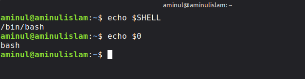
```

Commands:

```bash
echo $SHELL
echo $0
```

---

## 2. Bash lab setup

```markdown
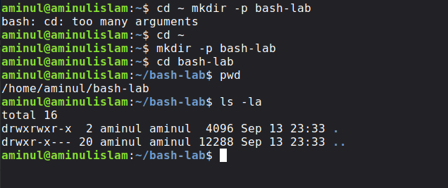
```

Commands:

```bash
pwd
ls -la
```

---

## 3. First Bash script

```markdown

```

Command:

```bash
cat hello.sh
```

---

## 4. Script execution and permissions

```markdown
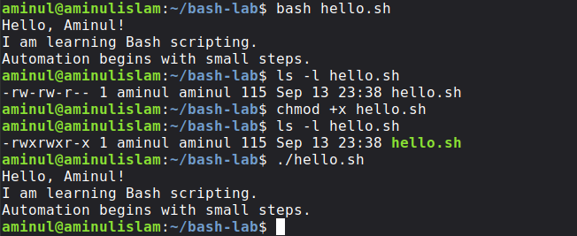
```

Commands:

```bash
ls -l hello.sh
chmod +x hello.sh
ls -l hello.sh
./hello.sh
```

---

## 5. Variables

```markdown
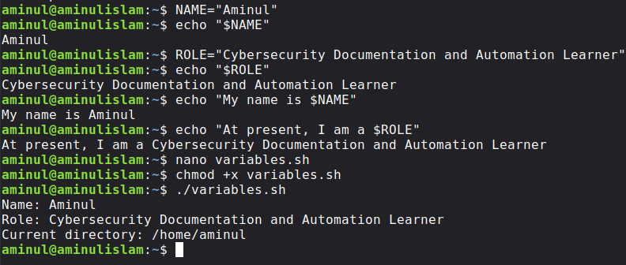
```

Command:

```bash
./variables.sh
```

---

## 6. User input

```markdown

```

Command:

```bash
./user-input.sh
```

---

## 7. Positional parameters

```markdown

```

Command:

```bash
./greet.sh Aminul Linux
```

---

## 8. Exit status

```markdown
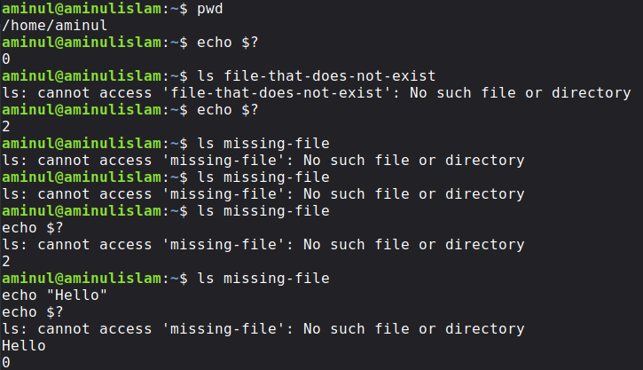
```

Commands:

```bash
pwd
echo $?

ls file-that-does-not-exist
echo $?
```

---

## 9. File conditional

```markdown
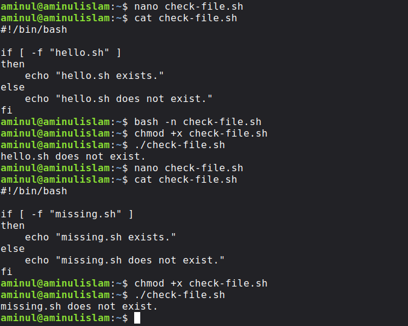
```

Commands:

```bash
cat check-file.sh
bash -n check-file.sh
./check-file.sh
```

---

## 10. Directory conditional

```markdown
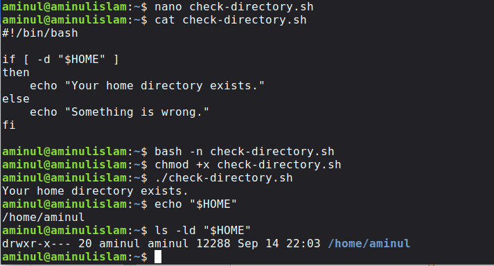
```

Commands:

```bash
echo "$HOME"
ls -ld "$HOME"
./check-directory.sh
```

---

## 11. For loop

```markdown
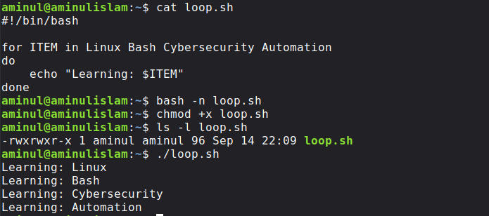
```

Commands:

```bash
cat loop.sh
bash -n loop.sh
chmod +x loop.sh
ls -l loop.sh
./loop.sh
```

---

## 12. File loop

```markdown

```

Command:

```bash
for FILE in *.sh
do
    echo "Script found: $FILE"
done
```

---

## 13. Pipes and redirection

```markdown
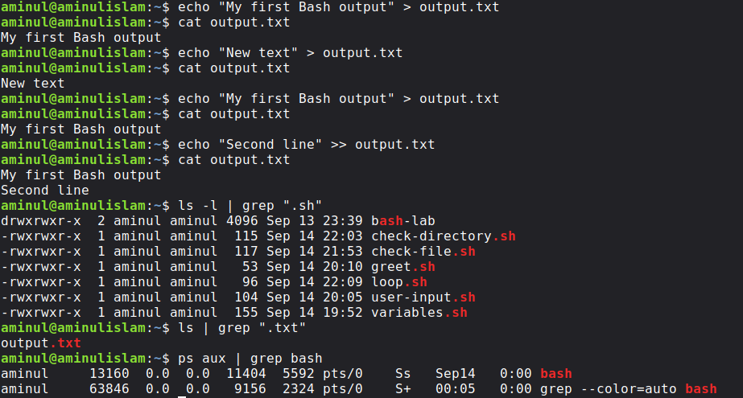
```

Commands:

```bash
cat output.txt
ls -l | grep ".sh"
```

---

## 14. Quoting

```markdown
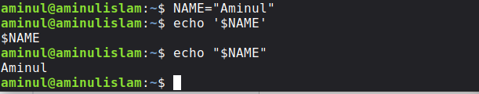
```

Commands:

```bash
NAME="Aminul"
echo '$NAME'
echo "$NAME"
```

---

## 15. System check

```markdown
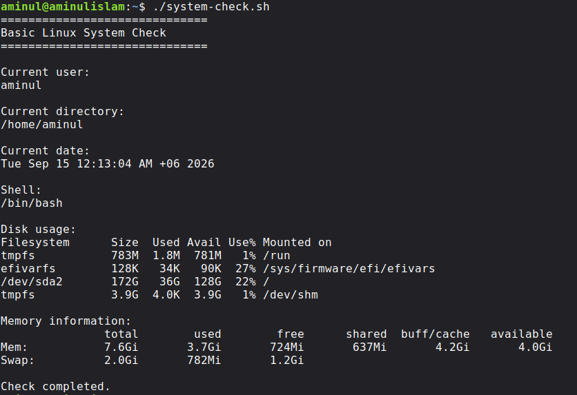
```

Command:

```bash
./system-check.sh
```

---

## 16. Saved system report

```markdown
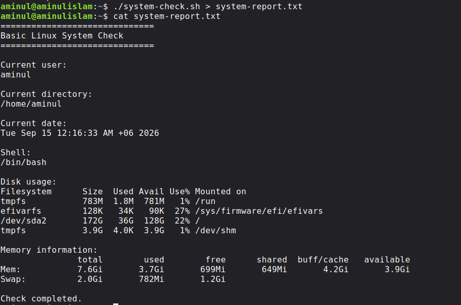
```

Commands:

```bash
./system-check.sh > system-report.txt
cat system-report.txt
```

---

## 17. Security-oriented check

```markdown
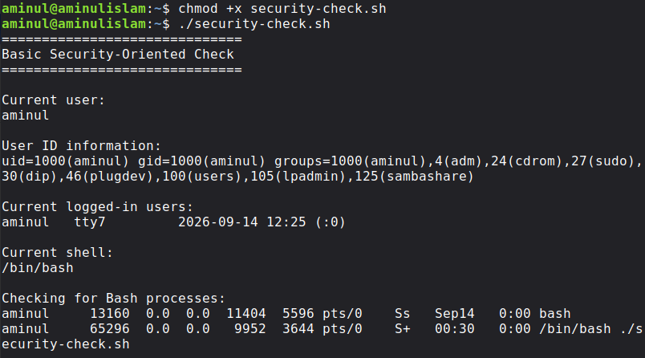
```

Command:

```bash
./security-check.sh
```

---

## 18. Exit status inside a script

```markdown
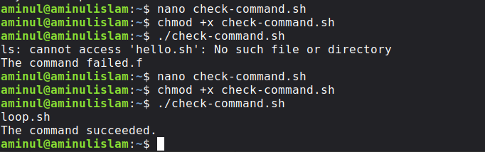
```

This should show the corrected `check-command.sh` handling both a successful and failed command.

---

## 19. Final automation project

```markdown
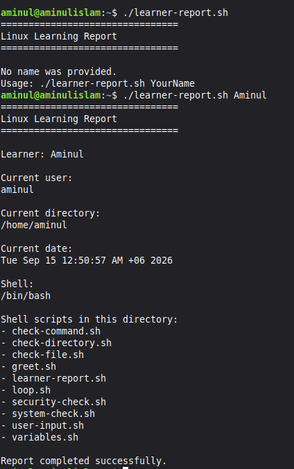
```

Commands:

```bash
./learner-report.sh
./learner-report.sh Aminul
```

---

# Skills Developed

By completing this lesson, I practiced:

- Bash shell usage
- Shell script creation
- Script execution
- File permissions
- Variables
- User input
- Positional parameters
- Exit status
- Conditional logic
- File and directory tests
- `for` loops
- Wildcard patterns
- Output redirection
- Output appending
- Pipelines
- Quoting
- Basic system information collection
- Basic security-oriented information collection
- Bash syntax checking
- Troubleshooting
- Small-scale automation

---

# Related Commands

Commands I practiced in this lesson include:

```bash
echo
cd
mkdir
pwd
ls
cat
nano
chmod
bash
read
whoami
date
ps
grep
df
free
id
who
```

Bash features I practiced include:

```bash
$SHELL
$0
$1
$2
$?
$HOME
$PWD
>
>>
|
if
then
else
fi
for
do
done
```

---

# Reflection

Before this lesson, I mostly thought of the terminal as a place where I type commands one by one.

Bash changed that picture for me.

I learned that I can put several commands into a file and make the computer repeat the work for me.

For example, instead of manually running:

```bash
whoami
pwd
date
df -h
free -h
```

I can put them into a script and run:

```bash
./system-check.sh
```

I also learned that Bash does not forgive small mistakes.

These are different:

```text
fi
Fi
```

and:

```text
done
Done
```

A missing letter, wrong capitalization, wrong filename, or wrong directory can change the result.

That made me understand why testing and careful documentation matter.

The most important idea I am taking from this lesson is simple:

> **A command helps me do a task. A Bash script helps me automate a task.**

That is an important step toward the kind of cybersecurity documentation and automation work I want to learn.

---

# Next Step

The next and final lesson of Month 2 is:

```text
Lesson 10 — Logs
```

There I will learn how Linux records events and how those records can help with troubleshooting, system administration, and basic security investigation.

---

# References

- GNU Bash Reference Manual — Bash shell, shell scripting, variables, quoting, pipelines, positional parameters, exit status, and shell grammar.
- Linux command-line manual pages for commands practiced in this lesson, including `bash`, `chmod`, `echo`, `read`, `ps`, `grep`, `df`, and `free`.

