# Lesson 10 — Linux Logs

**Month 2: Linux Command-Line Interface (CLI)**  
**Learning path:** Cybersecurity Documentation & Automation Engineer  
**Learner:** Aminul Islam  
**Environment:** Linux Mint, systemd, Bash  
**Lab directory:** `~/3-CyberLab/Linux-CLI-Month-2/10-Logs`  
**Practice date:** 27–28 September 2026


## 1. Learning Objectives

In this lesson, I practised how to:

- Explore Linux log files and directories under `/var/log`.
- Read recent system journal entries and inspect the current and previous boots.
- Filter journal entries by time, priority, and kernel or service.
- Follow and search log messages.
- Inspect journal disk usage and login history.
- Use `grep` to search a sample log.
- Write and troubleshoot a small Bash log-summary script.
- Treat logs as evidence during system and security investigations.

## 2. What I Learned

A log is a record of events produced by the operating system, services, applications, or other components. Logs can help explain what happened, when it happened, and which component reported it.

Linux systems may store traditional text logs in `/var/log`. Systems using systemd also provide a journal that can be queried with `journalctl`. Depending on the system, the same event may appear in more than one logging destination.

Logs are useful in troubleshooting and security work, but a log entry is evidence to investigate—not automatically proof of a root cause or an attack.

## 3. Exploring `/var/log`

I first inspected the main log directory:

```bash
ls -lah /var/log
```

The output showed approximately **9.1 MB** in the directory at that time, along with a mixture of files and subdirectories. I also found rotated log files such as `auth.log.1` and compressed older files such as `auth.log.2.gz`.

I listed files and directories separately:

```bash
find /var/log -maxdepth 1 -type f -printf '%f\n' | sort
find /var/log -maxdepth 1 -type d -printf '%f/\n' | sort
```

Among the files were `auth.log`, `boot.log`, `dpkg.log`, `kern.log`, `syslog`, `wtmp`, and `btmp`. The directory listing included `apt/`, `journal/`, `lightdm/`, `timeshift/`, and other application-specific locations.

I also checked the sizes and permissions of `.log` files:

```bash
ls -lh /var/log/*.log 2>/dev/null | head -20
```

The output showed that `auth.log` and `kern.log` were owned by `syslog` and had restricted permissions. This reminded me that logs may contain sensitive information and that permissions are part of log security.

### A small command-line mistake

At first, I typed `~ls -lah /var/log` and received a “command not found” message. The correct command is `ls -lah /var/log`. The tilde represents the home directory; it is not a prefix for `ls`.

## 4. Reading the system journal

I used `journalctl` to inspect recent entries:

```bash
journalctl -n 20 --no-pager
```

I then restricted the output to the current boot:

```bash
journalctl -b --no-pager -n 30
```

To inspect the available boot history, I ran:

```bash
journalctl --list-boots --no-pager
```

My output showed multiple retained boots, indexed from `-34` through `0`. This let me identify the current boot and select earlier ones. I inspected the previous boot with:

```bash
journalctl -b -1
```

The previous-boot output included systemd startup activity, services, sockets, and timers. This demonstrated how boot records can help reconstruct the sequence of system startup events.

## 5. Filtering by Time

I queried entries from today:

```bash
journalctl --since today --no-pager -n 30
```

I also looked at a rolling time window:

```bash
journalctl --since "1 hour ago" --no-pager
```

The time filters returned a large amount of repeated wireless and kernel activity. This showed why narrowing a log query by time—and often limiting the number of lines—makes investigation more manageable.

## 6. Filtering by Priority

I practised filtering warning-level and error-level entries:

```bash
journalctl -p warning --no-pager -n 30
journalctl -p err --no-pager -n 30
```

The warning output included repeated correctable PCIe Data Link Layer messages involving the `ath9k` wireless device.

The error-level output included older records involving Bluetooth SAP initialization, VirtualBox service startup, Casper checksum checking, a TPM firmware/ACPI message, a LightDM keyring message, and a Timeshift process crash. These records came from different times and boots. They should be investigated individually rather than treated as one current failure.

A priority filter is a way to narrow the evidence. It does not by itself establish severity in the practical sense, user impact, or root cause.

## 7. Inspecting Kernel Logs

I queried kernel messages directly:

```bash
journalctl -k --no-pager -n 30
```

My journal repeatedly reported messages similar to:

```text
PCIe Bus Error: severity=Correctable, type=Data Link Layer
device [168c:0036] error status/mask=00000080/00002000
[ 7] BadDLLP
```

The messages involved the `ath9k` wireless device and its PCIe connection. I also saw signal-change events from `wpa_supplicant` for interface `wlp3s0`, with signal values fluctuating during the session.

These entries are useful clues for a separate investigation into wireless stability or the PCIe link. They do not, on their own, prove the cause of any connectivity problem. A careful investigation would correlate timestamps with actual symptoms and other diagnostic evidence.

## 8. Connecting Logs to Services

I listed running services:

```bash
systemctl list-units --type=service --state=running --no-pager | head -20
```

I first tried the placeholder literally:

```bash
journalctl -u SERVICE_NAME.service --no-pager -n 30
```

It returned `-- No entries --`. The placeholder must be replaced with a real unit name. I then queried CUPS:

```bash
journalctl -u cups.service --no-pager -n 30
```

This demonstrated how `journalctl -u` can narrow the journal to a particular service. A service may have no entries in the selected time range, so an empty result is not necessarily a command failure.

## 9. Following and Searching Logs

I used the live-follow mode:

```bash
journalctl -f
```

This displays new journal entries as they arrive. I stopped it with `Ctrl+C`.

I searched for error-related messages in two ways:

```bash
journalctl --no-pager | grep -i error | tail -20
journalctl --grep=error --no-pager -n 20
```

The first approach pipes journal output to `grep` and then limits the result with `tail`. The second uses journalctl's own message matching option. Search results depend on the selected text and available journal entries; a text match is not a complete diagnosis.

## 10. Journal Disk Usage

I checked how much disk space the journal occupied:

```bash
journalctl --disk-usage
```

My output was:

```text
Archived and active journals take up 460.5M in the file system.
```

This gave me a practical example of checking journal storage. I did not delete or vacuum logs during the exercise because preserving evidence is more important than cleaning up without a specific reason.

## 11. Login History and Authentication Logs

I checked whether the traditional authentication log existed:

```bash
ls -l /var/log/auth.log 2>/dev/null
```

It existed and had restricted permissions. I did not include its raw contents in this public journal because authentication logs can expose usernames, session details, and other sensitive information.

I inspected recent login and reboot history:

```bash
last -n 10
```

The output showed the `aminul` graphical session, reboot records, and the start of the `wtmp` history. I also tried:

```bash
lastb -n 10
```

It failed with `Permission denied` when accessing `/var/log/btmp`. Running it with elevated privileges worked:

```bash
sudo lastb -n 10
```

The output contained one recorded entry for `aminul` on `tty7`; `btmp` began on 17 September 2026. A record in `btmp` should be interpreted in context and is not automatically proof of an external login attack.

## 12. Creating a Safe Sample Log

To practise log analysis without exposing real system records, I created `lesson10-demo.log` in my lab directory. It contained four deliberately constructed entries:

```text
2026-09-15 22:00:00 INFO Lesson 10 log laboratory started
2026-09-15 22:01:00 INFO Checking Bash laboratory
2026-09-15 22:02:00 WARNING Example warning message
2026-09-15 22:03:00 ERROR Example error message
```

I inspected and searched it:

```bash
cat lesson10-demo.log
grep "ERROR" lesson10-demo.log
grep -i "warning" lesson10-demo.log
grep -c "INFO" lesson10-demo.log
grep -c "ERROR" lesson10-demo.log
grep -n "ERROR" lesson10-demo.log
grep -n -E "WARNING|ERROR" lesson10-demo.log
```

The searches returned the matching entries. The count commands returned `2` for INFO and `1` for ERROR. The line-number searches located WARNING on line 3 and ERROR on line 4.

## 13. Writing a Bash Log Analyzer

I created `log-summary.sh` to count INFO, WARNING, and ERROR entries in the sample file. The final working script was:

```bash
#!/bin/bash

LOG_FILE="lesson10-demo.log"

echo "=============================="
echo "Lesson 10 Log Summary"
echo "=============================="

if [ -f "$LOG_FILE" ]
then
    echo
    echo "Log file: $LOG_FILE"
    echo
    echo "INFO messages:"
    grep -c "INFO" "$LOG_FILE"

    echo
    echo "WARNING messages:"
    grep -c "WARNING" "$LOG_FILE"

    echo
    echo "ERROR messages:"
    grep -c "ERROR" "$LOG_FILE"

    echo
    echo "Log analysis completed."
else
    echo "Log file does not exist:"
    echo "$LOG_FILE"
fi
```

I made the script executable and ran it. The final output was:

```text
==============================
Lesson 10 Log Summary
==============================

Log file: lesson10-demo.log

INFO messages:
2

WARNING messages:
1

ERROR messages:
1

Log analysis completed.
```

This small script brought together several skills from earlier lessons: file checks, variables, conditional logic, command execution, and text searching.

### Troubleshooting the script

My first syntax check returned:

```text
log-summary.sh: line 31: syntax error: unexpected end of file
```

The script displayed its heading but failed before completing the analysis. I stopped the repeated attempt, opened the file in `nano`, corrected the script, and ran it again. The final run completed successfully and printed the expected counts.

The lesson for me was to use `bash -n` to check syntax before relying on a script's output. When Bash reports an unexpected end of file, I should inspect paired structures such as `if`/`fi`, loops, and quotation marks. I found "fi" was mistakenly written as "Fi". So, I corrected to "fi". 

## 14. Mistakes I Made (Learning Moments)

1. **Tilde before a command:** I typed `~ls` instead of `ls`. I learned that `~` is a path shortcut, not a general command prefix.
2. **Using a placeholder literally:** `SERVICE_NAME.service` returned no entries because it was not an actual service name. I replaced it with `cups.service`.
3. **Reading protected login-failure records without privileges:** `lastb` could not open `/var/log/btmp` as my normal user. `sudo lastb -n 10` worked.
4. **Bash syntax error in my log analyzer:** My first script had an incomplete or mismatched structure. `bash -n` exposed the error; editing the script fixed it.
5. **Repeatedly running a broken script:** Running it again did not fix the syntax error. I learned to stop, inspect, and correct the source before retrying.

Mistakes are useful when I record what happened, identify the cause, and verify the correction.

## 15. Security Perspective

Logs are an important source of evidence in system administration and cybersecurity. They can help answer questions such as:

- Which service reported an event?
- When did an event occur?
- Did it happen during boot or during normal operation?
- Are similar events repeating?
- Does the event correlate with a user-visible problem?
- Is the evidence from the current boot or an older one?

My practice also reinforced several precautions:

- Do not publish raw authentication logs, journal dumps, or login records to a public repository.
- Keep the original evidence intact when investigating an incident.
- Use time, service, and priority filters to narrow searches.
- Do not label every error as an attack or assume that a warning is harmless.
- Correlate log messages with other evidence before drawing conclusions.
- Avoid deleting or vacuuming logs just to make the output shorter.

## 16. Screenshots

### 1. Boot History

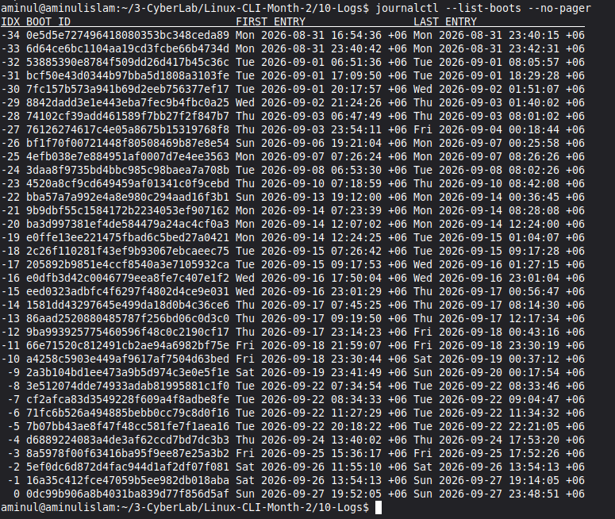


### 2. Current Boot Information

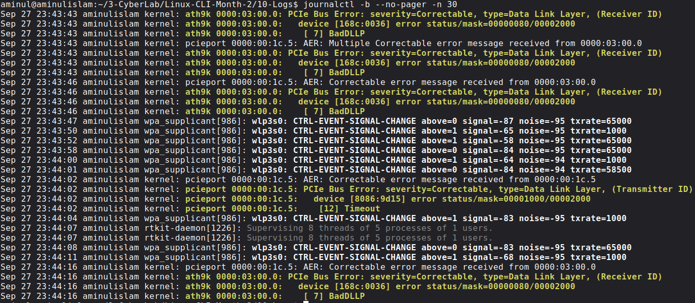


### 3. Disk Usage

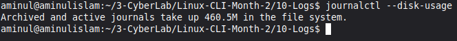


### 4. Log Errors

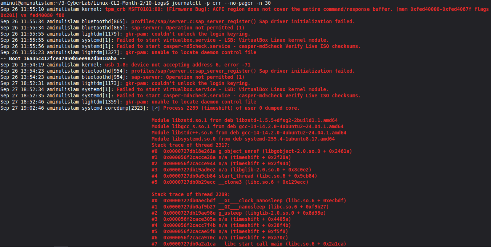


### 5. Follow Logs in Real Time

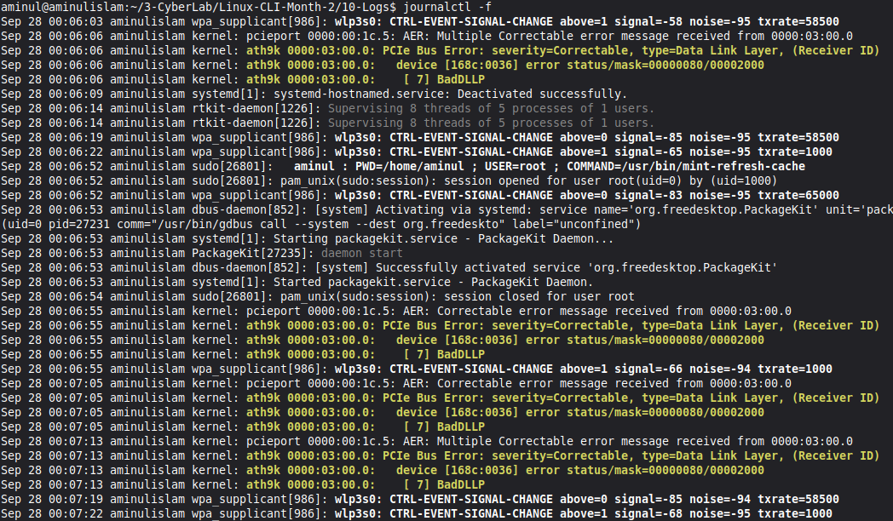


### 6. Kernel Logs

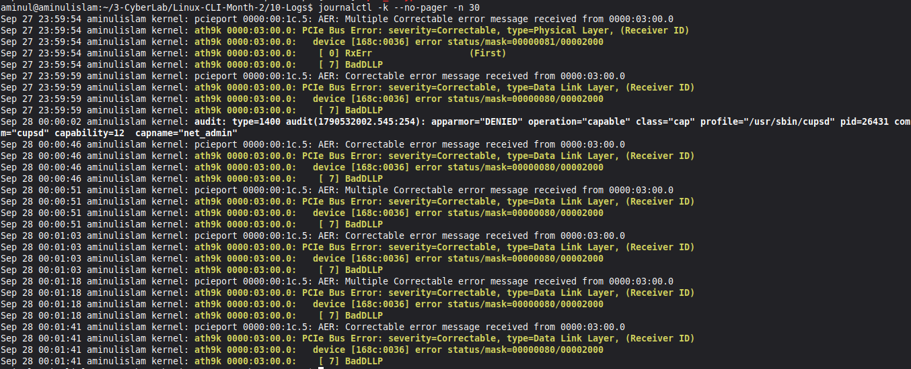


### 7. View Recent Log Entries

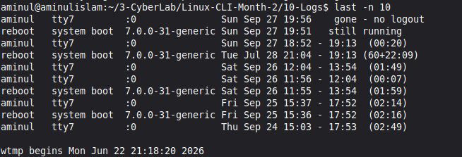


### 8. Log Analyzer

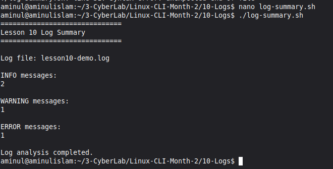


### 9. Log Inventory — Part 1

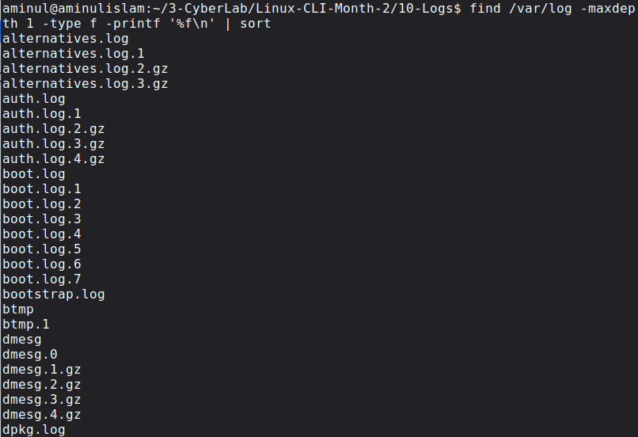


### 10. Log Inventory — Part 2

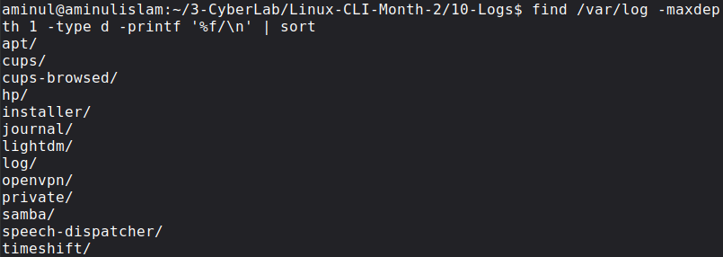


### 11. Recent Logs

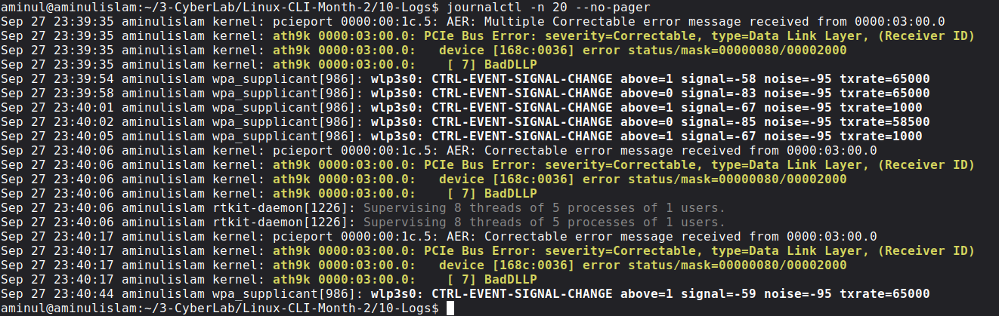


### 12. Search Logs

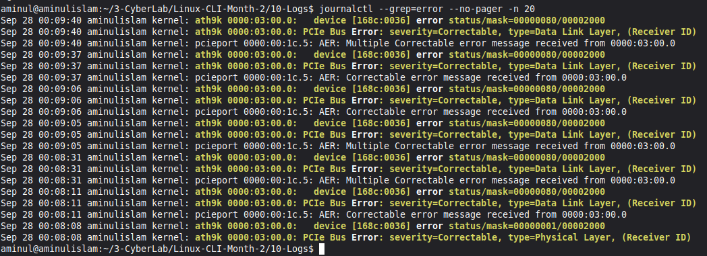


### 13. Service Logs

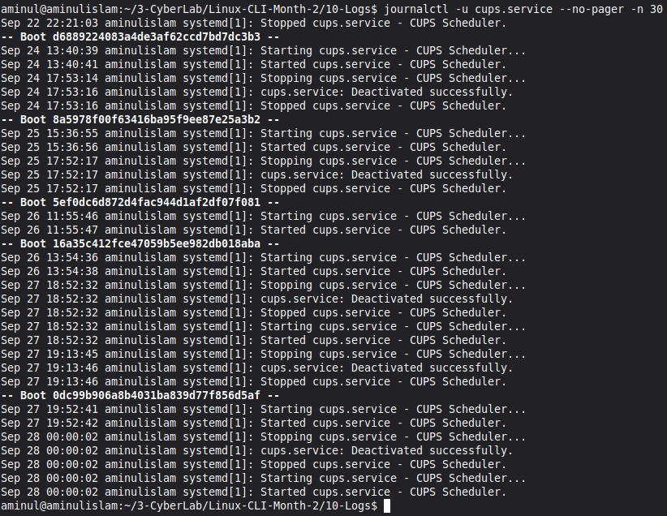


### 14. Today's Logs

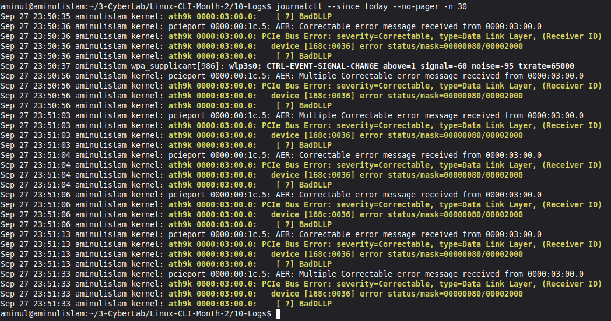


### 15. View `/var/log`

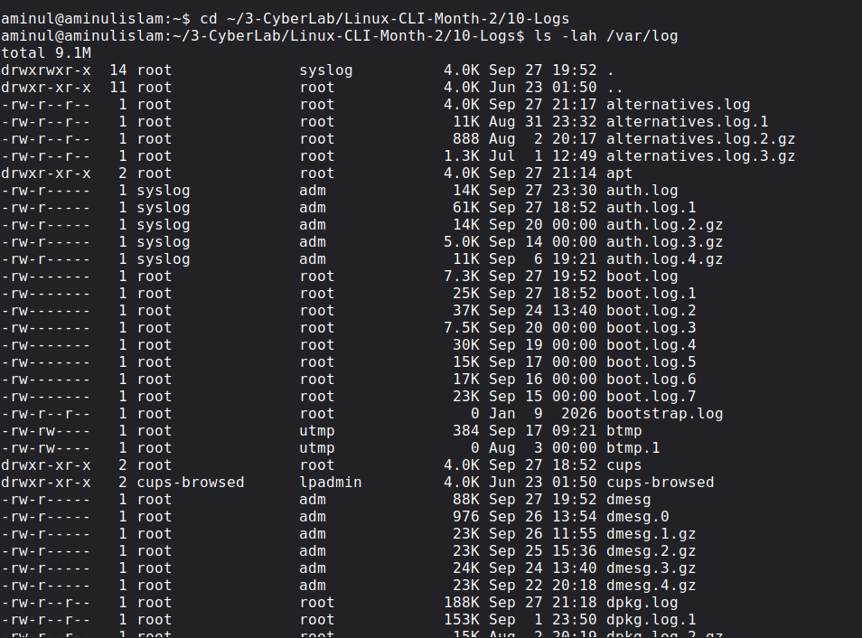


### 16. Log Warnings

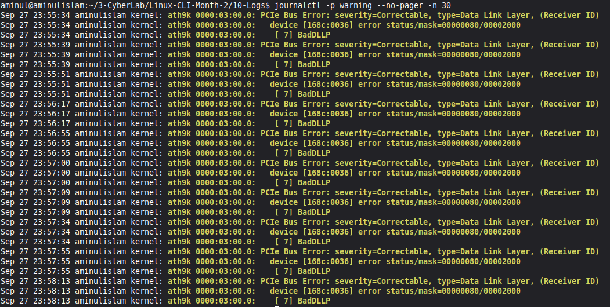


## 17. Skills Developed

- Navigating and inventorying `/var/log`
- Reading text logs and understanding rotated log files
- Querying the systemd journal with `journalctl`
- Filtering logs by boot, time, priority, kernel, and service
- Following and searching log messages
- Checking journal disk usage
- Inspecting login history with `last` and `lastb`
- Using `grep` for matching, counting, and line-number searches
- Writing and debugging a Bash log-analysis script
- Handling sensitive log evidence responsibly

## 18. Month 2 — Connecting the Lessons

This final lesson connected the command-line skills I practised throughout Month 2:

- **Filesystem and navigation:** finding and inspecting files and directories.
- **File operations:** creating and managing lab files.
- **Permissions and ownership:** understanding why some logs are restricted.
- **Processes and services:** relating system activity to the components that produce log entries.
- **Package management:** recognizing that software and service changes can leave records.
- **Bash:** automating a small, repeatable analysis task.
- **Logs:** using recorded events to investigate what happened.

A practical investigation can follow a simple chain: identify a symptom, inspect the relevant service or process, query the corresponding logs, narrow the time window, and preserve the evidence.

## 19. Reflection

This lesson helped me see logs as more than lines of text. They are records that can support troubleshooting and security investigations when read carefully and in context.

The repeated PCIe messages and fluctuating wireless signal entries gave me a real example of why logs need interpretation rather than blind acceptance. The Bash analyzer also showed how a small script can make a repetitive task easier, provided that I validate it and verify its output.

With Lesson 10, I have completed the ten lessons of Month 2: Linux CLI. My next step is to review and organize the evidence from the month and continue building practical cybersecurity documentation and automation skills.

---

**Evidence note:** This journal records the terminal activity and final script output supplied for Lesson 10. It does not claim that every system message has been diagnosed or resolved.
